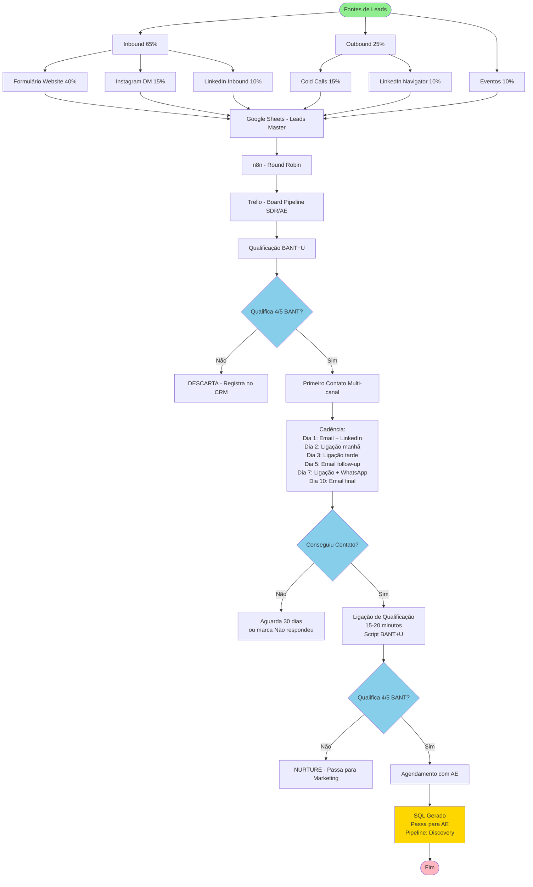

# 📋 PROCESSOS COMERCIAIS - AERION TECHNOLOGIES

**Documento de Processos e Fluxogramas**  
*Versão 1.1 - Janeiro 2026*

---

## ÍNDICE

1. [Visão Geral do Departamento Comercial](#1-visão-geral)
2. [Processo de Prospecção (SDR)](#2-processo-de-prospecção-sdr)
3. [Processo de Qualificação de Leads](#3-processo-de-qualificação-de-leads)
4. [Processo de Vendas Diretas (AE)](#4-processo-de-vendas-diretas-ae)
5. [Processo de Gestão de Canais](#5-processo-de-gestão-de-canais)
6. [Processo de Licitações Públicas](#6-processo-de-licitações-públicas)
7. [Processo de Customer Success](#7-processo-de-customer-success)
8. [Reuniões e Rituais Comerciais](#8-reuniões-e-rituais)
9. [Ferramentas e Sistemas](#9-ferramentas-e-sistemas)
10. [Operação do ERP Sankhya para Vendedores](#10-operação-do-erp-sankhya-para-vendedores)
11. [Documentação Complementar](#11-documentação-complementar)

---

## 1. VISÃO GERAL DO DEPARTAMENTO COMERCIAL

### 1.1 Estrutura Organizacional

⚠️ **ESTRUTURA FUTURA - Ano 1 (2026) opera com 4 pessoas multi-chapéu**

*Os processos abaixo são desenhados para escala (13-30 pessoas). Em 2026, o Head acumula funções de SDR, AE e Channel Manager.*

```
                    ┌──────────────────────┐
                    │  HEAD COMERCIAL      │
                    │                      │
                    │  Meta: R$ 3.6M/ano   │
                    └──────────┬───────────┘
                               │
              ┌────────────────┼────────────────┐
              │                │                │
              ▼                ▼                ▼
    ┌─────────────────┐ ┌──────────────┐ ┌──────────────┐
    │ EQUIPE DE       │ │ EQUIPE DE    │ │ EQUIPE DE    │
    │ PROSPECÇÃO      │ │ FECHAMENTO   │ │ CANAIS       │
    │                 │ │              │ │              │
    │ • 3 SDRs        │ │ • 5 AEs      │ │ • 3 Channel  │
    │ • Meta: 180     │ │ • Meta: R$   │ │   Managers   │
    │   SQLs/mês      │ │   750k/mês   │ │ • Meta: R$   │
    │                 │ │              │ │   1.2M/mês   │
    └─────────────────┘ └──────────────┘ └──────────────┘
                               │
                               ▼
                    ┌──────────────────────┐
                    │ CUSTOMER SUCCESS     │
                    │                      │
                    │ • 2 CSMs             │
                    │ • Meta: NPS 80+      │
                    │ • Churn < 5%         │
                    └──────────────────────┘
```

**Estrutura Real 2026 (Multi-chapéu):**
- **Head Comercial e Produtos:** Estratégia/Liderança (40%) + Gestão Canais (25%) + Vendas Enterprise (20%) + Produtos (10%) + Marketing (5%) - Meta: R$ 1.8M/ano
- **Vendedor 1 - Vendas Consultivas:** Prospecção (33%) + Vendas e Fechamento (33%) + Customer Success (34%) - Meta: R$ 900k/ano
- **Vendedor 2 - Vendas Consultivas:** Prospecção (33%) + Vendas e Fechamento (33%) + Customer Success (34%) - Meta: R$ 900k/ano
- **Estagiária Marketing:** Geração Leads (40%) + Criação Conteúdo (30%) + Redes Sociais (20%) + Eventos (10%) - Meta: 300 leads/ano

**Nota:** Modelo Aaron Ross adaptado para time limitado - todos os vendedores fazem prospecção, closing e customer success.

### 1.2 Modelo de Receita Previsível (Aaron Ross)

A Aerion adota o modelo de **especialização de funções** proposto no livro "Receita Previsível":

**Princípios Fundamentais:**

1. **Separação Clara de Funções**
   - SDRs focam 100% em prospecção e qualificação
   - AEs focam 100% em fechamento
   - Channel Managers focam 100% em gestão de canais
   - Sem overlap de responsabilidades

2. **Processo Previsível e Escalável**
   - Cada etapa tem métricas claras
   - Funil bem definido com taxas de conversão
   - Processo pode ser replicado com novos contratados

3. **Foco em Volume + Qualidade**
   - SDRs geram volume constante de leads qualificados
   - AEs mantém alta taxa de conversão
   - Resultado: crescimento previsível

### 1.3 Métricas Principais do Departamento

| Métrica | Meta Mensal | Meta Anual |
|---------|-------------|------------|
| **Receita Total** | R$ 2.617.000 | R$ 31.405.000 |
| **Número de Vendas** | 25 deals | 300 deals |
| **Ticket Médio** | R$ 104.700 | R$ 104.700 |
| **SQLs Gerados** | 180 | 2.160 |
| **Taxa Conversão SQL→Venda** | 13,9% | 13,9% |
| **Ciclo de Venda Médio** | 62 dias | 62 dias |
| **CAC** | R$ 8.200 | R$ 8.200 |
| **LTV/CAC Ratio** | 6,3 | 6,3 |

## VERSÃO 2026: ADAPTAÇÃO PARA EQUIPE PEQUENA

Em 2026, com 4 pessoas multi-chapéu, usamos versão ADAPTADA que mantém princípios mas simplifica execução:

### CRM: 2 Boards Trello
- **Board 1: Pipeline de Vendas** (10 listas) - SDR + AE
- **Board 2: Clientes e Pós-Venda** (8 listas) - CS + Recompra
- **Labels:** 9 estratégicas (vertical, tipo, tier, prioridade)
- **Custom Fields:** 5-6 essenciais

### Planilhas: 2 Google Sheets
- **Planilha 1: Leads e Pipeline** (12 colunas)
- **Planilha 2: Revendas Ativas** (15 colunas com fórmulas)
- **Sincronização:** n8n automatiza Trello → Sheets

### Processo de Canais Simplificado:
1. **Pré-qualificação ICP** (5 min) - Score 700+
2. **Prospecção** (1 semana) - BANT+U + Apresentação
3. **Onboarding** (2 dias) - Documentos + Ativação
4. **Gestão** (mensal/trimestral) - Check-ins

### Princípios Mantidos:
- ✅ Técnicas Chris Voss (perguntas calibradas, mirroring, labeling)
- ✅ BANT+U completo para qualificação
- ✅ ICP com scoring (simplificado para 5 critérios)
- ✅ Separação conceitual SDR/AE/CS
- ✅ Processos estruturados mas ágeis

### Scripts Práticos:
- 2-3 páginas cada (não 1, não 10)
- Conteúdo acionável
- Exemplos reais
- Checklists inclusos

---

## 2. PROCESSO DE PROSPECÇÃO (SDR)

### 2.1 Objetivo do Processo

**Input:** Leads crus (MQLs de marketing + listas de prospecção outbound)  
**Output:** SQLs qualificados e agendados para AEs  
**Responsável:** SDRs (Sales Development Representatives)  
**Meta:** 60 SQLs por SDR/mês (180 total com 3 SDRs)

### 2.2 Fluxograma de Prospecção

```
FONTES DE LEADS (100%)
│
├─ Inbound (65%)
│  ├─ Formulário Website (40%)
│  ├─ Instagram DM (15%)
│  └─ LinkedIn Inbound (10%)
│
├─ Outbound (25%)
│  ├─ Cold Calls (15%)
│  └─ LinkedIn Navigator (10%)
│
└─ Eventos (10%)

     ↓ (Todos convergem)

[GOOGLE SHEETS - Leads Master]
     ↓
[n8n - Round Robin]
     ↓
[TRELLO - Board 1: Pipeline SDR/AE]
     ↓
[Qualificação BANT+U]
     ↓
[SQL → Demo → Proposta → Fechamento]
             │
        ┌────┴────┐
        │   NÃO   │────────► DESCARTA (Registra no CRM)
        │         │
        │   SIM   │
        └────┬────┘
             │
             ▼
┌─────────────────────────────────────┐
│ 3. PRIMEIRO CONTATO                 │
│    (Multi-canal)                    │
│                                     │
│ Sequência de Cadência:              │
│ Dia 1:  Email + LinkedIn            │
│ Dia 2:  Ligação (manhã)             │
│ Dia 3:  Ligação (tarde)             │
│ Dia 5:  Email follow-up             │
│ Dia 7:  Ligação + WhatsApp          │
│ Dia 10: Email final                 │
└────────────┬────────────────────────┘
             │
             ▼
        ┌────┴────┐
        │Conseguiu │
        │Contato?  │
        └────┬────┘
             │
        ┌────┴────┐
        │   NÃO   │────────► Aguarda 30 dias → Nova tentativa
        │         │           ou marca como "Não respondeu"
        │   SIM   │
        └────┬────┘
             │
             ▼
┌─────────────────────────────────────┐
│ 4. LIGAÇÃO DE QUALIFICAÇÃO          │
│    (15-20 minutos)                  │
│                                     │
│ Script BANT+U:                      │
│ • Budget: Tem orçamento?            │
│ • Authority: É o decisor?           │
│ • Need: Qual a necessidade?         │
│ • Timeline: Quando implementar?     │
│ • Use Case: Aplicação clara?        │
└────────────┬────────────────────────┘
             │
             ▼
        ┌────┴────┐
        │Qualifica │
        │4/5 BANT? │
        └────┬────┘
             │
        ┌────┴────┐
        │   NÃO   │────────► NURTURE (Passa para Marketing)
        │         │
        │   SIM   │
        └────┬────┘
             │
             ▼
┌─────────────────────────────────────┐
│ 5. AGENDAMENTO COM AE               │
│                                     │
│ Ações:                              │
│ • Agenda demo/reunião com AE        │
│ • Envia email de confirmação        │
│ • Preenche ficha completa no CRM    │
│ • Notifica AE responsável           │
│ • Envia material pré-reunião        │
└────────────┬────────────────────────┘
             │
             ▼
        ┌────┴────┐
        │   SQL   │────────► PASSA PARA AE
        │ GERADO  │          (Pipeline: Discovery)
        └─────────┘
             │
             ▼
           FIM
```

### 2.2.1 Código Mermaid - Fluxograma de Prospecção



### 2.2.2 Diagrama Mermaid Renderizado - Fluxograma de Prospecção


### 2.3 Script de Qualificação BANT+U

#### **Abertura (30 segundos) - Técnica Chris Voss**

> "Bom dia [Nome], aqui é [Seu Nome] da Aerion Technologies. Recebi seu contato através [fonte]. Nós somos especializados em soluções de drones para [segmento dele]."
> 
> **[PAUSA - Aguarda resposta]**
>
> "Imagino que agora é um momento terrível para conversarmos, não é?"

**Por quê funciona (Chris Voss):**  
- Busca o "não" → Cliente se sente no controle
- Resposta esperada: "Não, pode falar" (mais genuíno que "sim" forçado)
- Se disser "Sim, é ruim": "Sem problemas! Quando seria melhor? Amanhã às 10h te atende mal?" (de novo, busca o "não")

#### **B - Budget (Orçamento) - Com Perguntas Calibradas**

> "Só para entender o contexto: **como** vocês costumam avaliar investimentos em tecnologia? Existe algum budget já separado ou isso passa por aprovação caso a caso?"
>
> [Se mencionarem valor] **Mirroring:** "Então vocês têm cerca de R$ X...?" [pausa - deixa elaborar]
>
> [Se não tiverem orçamento] "Entendo. E **o que** precisaria acontecer para vocês conseguirem esse investimento?"

**Por quê funciona (Chris Voss):**  
- "Como" e "O que" = perguntas abertas, cliente pensa e revela processo
- Mirroring = cliente elabora sozinho, você aprende mais
- Não é interrogatório, é conversa colaborativa

**Respostas possíveis:**
- ✅ "Temos R$ X aprovado" → EXCELENTE
- ⚠️ "Depende do ROI apresentado" → MÉDIO (foco em ROI na proposta)
- ❌ "Sem budget este ano" → "Quando vocês revisam orçamento normalmente?"

#### **A - Authority (Autoridade) - Labeling + Calibradas**

> **[Labeling primeiro]** "Imagino que uma decisão dessas não seja tomada sozinho, né? **Como** funciona o processo de aprovação de investimentos aí?"
>
> **[Se não for decisor]** "Legal. E **o que** seu [diretor/sócio] mais valoriza numa decisão dessas? O que te faria parecer um herói levando essa proposta pra ele?"

**Por quê funciona (Chris Voss):**  
- Labeling ("não é sozinho") = mostra que você entende realidade dele, gera confiança
- "Como funciona" = descobre o processo completo
- "O que te faria parecer herói" = agora você e ele estão do mesmo lado!

**Respostas possíveis:**
- ✅ "Basicamente eu que decido, só aviso o pessoal" → EXCELENTE
- ⚠️ "Eu apresento e o [CEO/Sócio] aprova" → Perguntar: "Consigo participar da apresentação com vocês?"
- ❌ "Só faço análise, quem decide é X" → "Seria um absurdo eu conversar diretamente com [X]?"

#### **N - Need (Necessidade) - SPIN + Labeling**

> **[Situation]** "Me conta um pouco: como vocês fazem [processo atual] hoje?"
>
> **[Problem]** "E **o que** mais te frustra nesse processo atual?"
>
> **[Mirroring]** "Te frustra...?" [pausa]
>
> **[Labeling]** "Parece que isso tá custando não só dinheiro, mas também dor de cabeça e perda de sono, né?"
>
> **[Implication - Amplificar dor]** "Se você não resolver isso, **o que** acontece daqui 6 meses? Como isso afeta o resto da operação?"

**Escutar ativamente e identificar:**
- Dor específica (funcional e emocional)
- Impacto financeiro da dor (quantificar!)
- Impacto emocional (estresse, medo, frustração)
- Urgência real
- Já tentou resolver de outras formas? (Por que não deu certo?)

#### **T - Timeline (Linha do Tempo) - Criar Urgência com Calibradas**

> "Entendi. E **o que** acontece se vocês não resolverem isso nos próximos 3 meses? Qual o custo da inação?"
>
> **[Se disser "nada de grave"]** "Então não é tão urgente assim?" [Busca "não" - pode revelar urgência escondida]
>
> **[Se tiver urgência]** "E **como** vocês estão pensando em implementar? Qual seria o timeline ideal do ponto de vista de vocês?"

**Por quê funciona (Chris Voss):**  
- Custo da inação = cria urgência genuína (não forçada)
- "Você desistiu de resolver?" = busca "não" = revela se realmente importa

**Respostas possíveis:**
- ✅ "Se não resolver rápido, vou perder [X]" → URGENTE (cliente se convenceu)
- ⚠️ "Ideal seria este semestre" → Perguntar: "**O que** impede de ser antes?"
- ❌ "Só pesquisando, sem pressa" → "Entendo. **Quando** vocês costumam revisar isso novamente?" (nurture)

#### **U - Use Case (Caso de Uso)**

> "Perfeito. Só para eu entender qual seria a melhor solução para vocês: o uso seria principalmente para [pulverização/inspeção/mapeamento]? Já tem ideia da área/volume/frequência?"

**Objetivo:** Confirmar que temos solução adequada

#### **Fechamento e Agendamento - "Parece Justo?" + Calibradas**

> **[Resumo primeiro]** "Deixa eu ver se entendi: vocês precisam [X], mas estão enfrentando [problema Y], e isso tá custando [consequência Z]. E o ideal seria resolver isso em [timeline]. Acertei?"
>
> **[Aguarda confirmação - geralmente "Exatamente!"]**
>
> "Perfeito. Olha, baseado no que você me contou, **seria absurdo** eu não conectar você com [Nome do AE], que é nosso especialista em [segmento] e já ajudou empresas similares à sua com esse exato desafio. **Parece justo?**"
>
> **[Aguarda "Sim, faz sentido"]**
>
> "Ótimo. Ele vai fazer uma demonstração técnica focada especificamente no [necessidade específica dele]. Leva uns 30-40 minutos. **O que** funcionaria melhor para você: amanhã às 14h ou quinta às 10h?"
>
> **[Técnica "Isso ou aquilo" - não dá opção de não agendar]**

**Por quê funciona (Chris Voss):**  
- Resumo = valida que entendeu (cria alinhamento)
- "Seria absurdo não..." = busca "não" mas direciona para "sim"
- "Parece justo?" = desarma resistência, cria confiança
- "Isso ou aquilo" = assumir venda, não perguntar SE quer

### 2.4 Métricas e KPIs de SDR

| Métrica | Meta Individual | Meta Time (3 SDRs) |
|---------|-----------------|-------------------|
| **Atividades Diárias** | | |
| Ligações realizadas | 80-100 | 240-300 |
| Emails enviados | 50 | 150 |
| Conexões LinkedIn | 10 | 30 |
| **Resultados Semanais** | | |
| Conversas efetivas | 20 | 60 |
| Leads qualificados | 15 | 45 |
| **Resultados Mensais** | | |
| SQLs gerados | 60 | 180 |
| Taxa conversão MQL→SQL | 30% | 30% |
| Taxa show-up (presença AE) | 85% | 85% |
| **Qualidade** | | |
| Taxa SQL→Oportunidade | 50% | 50% |
| NPS do AE sobre lead | 8+ | 8+ |

### 2.5 Ferramentas e Templates

**Ferramentas Utilizadas:**
- CRM (Trello + Google Sheets)
- Google Voice ou CallTrackingMetrics
- **Sejda PDF Editor** (conferência e correção de documentos)
- LinkedIn Sales Navigator
- Email tracking (Mailtrack ou HubSpot)
- WhatsApp Business

**Templates Disponíveis:**

---

## 2.6 CONFERÊNCIA DE DOCUMENTOS PDF

### 2.6.1 Processo de Conferência de Propostas e Pedidos

**PROBLEMA IDENTIFICADO:** PDFs de propostas e pedidos saem com logo de outra empresa (limitação temporária do ERP).

**SOLUÇÃO:** Conferência manual obrigatória com correção via Sejda PDF Editor.

### 2.6.2 Checklist de Conferência PDF

#### **ANTES DO ENVIO (Obrigatório)**

```
□ 1. VERIFICAÇÃO DO LOGO
   □ Logo da Aerion Technologies está correto
   □ Não há logo de empresa anterior
   □ Qualidade da imagem adequada (resolução)

□ 2. DADOS DA EMPRESA
   □ Nome: Aerion Technologies
   □ CNPJ: [verificar se está correto]
   □ Endereço completo atualizado
   □ Telefone e email corretos

□ 3. DADOS DO CLIENTE
   □ Nome da empresa cliente correto
   □ CNPJ do cliente verificado
   □ Endereço de entrega correto
   □ Contato responsável atualizado

□ 4. CONTEÚDO COMERCIAL
   □ Produtos listados corretamente
   □ Preços atualizados (tabela vigente)
   □ Condições de pagamento corretas
   □ Prazo de entrega realista
   □ Validade da proposta (30 dias)

□ 5. FORMATAÇÃO E APRESENTAÇÃO
   □ Layout profissional e limpo
   □ Numeração de páginas
   □ Assinatura digital (se aplicável)
   □ Data de emissão correta
```

### 2.6.3 Processo de Correção com Sejda PDF Editor

#### **PASSO A PASSO - Correção de Logo**

1. **Acesso ao Sejda PDF Editor**
   - Acesse: https://www.sejda.com/pt/pdf-editor
   - Upload do PDF com problema

2. **Identificação do Logo Incorreto**
   - Localizar logo da empresa anterior
   - Identificar posição exata no documento

3. **Substituição do Logo**
   - Usar ferramenta "Adicionar Imagem"
   - Upload do logo correto da Aerion
   - Posicionar no local exato
   - Ajustar tamanho para corresponder ao original

4. **Remoção do Logo Antigo**
   - Usar ferramenta "Adicionar Forma" (retângulo branco)
   - Cobrir logo antigo completamente
   - Ajustar cor para branco ou cor de fundo

5. **Verificação Final**
   - Revisar todo o documento
   - Confirmar que não há vestígios do logo antigo
   - Verificar qualidade da substituição

6. **Download e Salvamento**
   - Download do PDF corrigido
   - Salvar com nome: "[Cliente]_Proposta_[Data]_CORRIGIDO.pdf"
   - Backup do arquivo original

### 2.6.4 Responsabilidades por Função

#### **Account Executive (AE)**
- ✅ Conferir PDF antes do envio
- ✅ Executar correção via Sejda PDF Editor
- ✅ Validar dados do cliente
- ✅ Confirmar preços e condições

#### **Gerente Comercial**
- ✅ Revisar processo mensalmente
- ✅ Treinar equipe no uso do Sejda PDF Editor
- ✅ Manter template de logo atualizado
- ✅ Acompanhar métricas de qualidade

#### **Diretor Comercial**
- ✅ Aprovar processo de conferência
- ✅ Definir SLA para correções
- ✅ Escalar problema do ERP para TI

### 2.6.5 SLA e Métricas

| Métrica | Meta | Responsável |
|---------|------|-------------|
| **Tempo de Conferência** | < 15 min por PDF | AE |
| **Taxa de Erro** | < 2% dos PDFs enviados | AE |
| **Tempo de Correção** | < 30 min por PDF | AE |
| **Satisfação Cliente** | 100% PDFs sem erro | AE |

### 2.6.6 Escalação de Problemas

**Nível 1 - AE:** Correção via Sejda PDF Editor
**Nível 2 - Gerente:** Revisão e treinamento adicional
**Nível 3 - Diretor:** Escalação para TI/ERP

---

**Templates Disponíveis:**
- Email de primeiro contato (por vertical)
- Email de follow-up
- Script de cold call
- Mensagem LinkedIn
- Ficha de qualificação (CRM)

---

## 2.3 PROCESSO ESPECÍFICO - INBOUND (65%)

**O que muda: Primeira abordagem e SLA de resposta**  
**O que é igual: Planilha, Trello, qualificação, fechamento**

### 2.3.1 FORMULÁRIO WEBSITE (40%)

**Entrada Diferenciada:**

1. **Recebimento automático**
   - Webhook → Google Sheets (coluna "Canal": Formulário Website)
   - n8n cria card no Trello (label: Inbound - Website)
   - Notificação SMS + Email ao SDR

2. **SLA de Resposta: < 5 minutos**
   - Email automático confirmação
   - SDR liga imediatamente
   - Se fora horário: Email + agendar call

3. **Primeira Chamada (10-15 min)**
   - "Vi que você preencheu formulário sobre [X]"
   - Qualificação BANT simplificada
   - → Move card no Trello para "Em Qualificação"

**Convergência para Processo Unificado:**
- Card criado no mesmo Board Trello
- Mesma lista "Em Qualificação"
- Segue processo padrão de qualificação BANT+U
- Mesmas listas de progresso (SQL → Demo → Proposta)

### 2.3.2 INSTAGRAM (15%)

**Entrada Diferenciada:**

1. **Monitoramento ativo**
   - DMs/comentários respondidos em 15 min
   - Coleta manual de dados

2. **Registro no Sistema**
   - SDR cria lead manualmente no Google Sheets
   - Coluna "Canal": Instagram
   - n8n cria card no Trello (label: Inbound - Instagram)

3. **Primeira Ligação (24h)**
   - "Vi sua mensagem no Instagram sobre [X]"
   - Qualificação BANT
   - → Move card no Trello para "Em Qualificação"

**Convergência para Processo Unificado:**
- Mesmo Trello board
- Mesmas listas de progresso
- Mesmo processo de qualificação

### 2.3.3 LINKEDIN INBOUND (10%)

**Entrada Diferenciada:**

1. **Resposta no LinkedIn (< 2h)**
   - Comentário → Responder + enviar conexão
   - Mensagem direta → Responder

2. **Registro no Sistema**
   - SDR cria lead no Google Sheets
   - Coluna "Canal": LinkedIn Inbound
   - n8n cria card no Trello (label: Inbound - LinkedIn)

3. **Agendamento via LinkedIn**
   - Após 2-3 trocas, agendar call
   - → Card no Trello "Agendado"

**Convergência para Processo Unificado:**
- Mesmo board, mesmas listas
- Mesmo processo de qualificação

**Cadência Unificada Inbound (após primeira qualificação): 7 dias**
- Todos seguem MESMA cadência após qualificação inicial
- Dia 1: Demo/apresentação
- Dia 2: Proposta
- Dia 4: Follow-up 1
- Dia 7: Follow-up 2

---

## 2.4 PROCESSO ESPECÍFICO - OUTBOUND (25%)

**O que muda: Pesquisa inicial e cadência de contato**  
**O que é igual: Planilha, Trello, qualificação, fechamento**

### 2.4.1 COLD CALLS (15%)

**Entrada Diferenciada:**

1. **Upload de Lista**
   - SDR/Head importa lista no Google Sheets
   - Coluna "Canal": Cold Calls
   - Coluna "Status": A Contatar

2. **Pesquisa Pré-Contato (30 min/lead)**
   - LinkedIn, website, notícias
   - Registra insights na planilha

3. **n8n Distribui Leads**
   - Cria cards no Trello (label: Outbound - Cold Calls)
   - Lista "Inbox - Outbound"

4. **Cadência Outbound (15 dias - DIFERENTE)**
   - Dia 1: Email personalizado
   - Dia 3: Ligação 1
   - Dia 5: Email follow-up
   - Dia 7: Ligação 2 + WhatsApp
   - Dia 10: Email value-add
   - Dia 15: Ligação final

**Convergência:**
- Se consegue contato → Move para "Em Qualificação" (MESMA lista que inbound)
- A partir daqui: MESMO processo de qualificação BANT+U
- MESMAS listas de progresso

### 2.4.2 LINKEDIN SALES NAVIGATOR (10%)

**Entrada Diferenciada:**

1. **Busca e Conexão**
   - SDR busca no Sales Navigator
   - Envia conexão personalizada
   - Registra no Google Sheets: "LinkedIn Navigator"

2. **Pós-Conexão (10 dias)**
   - Dia 1: Agradecimento
   - Dia 3: Interação orgânica
   - Dia 7: Value-add
   - Dia 10: Agendamento

3. **n8n cria card ao agendar**
   - Trello (label: Outbound - LinkedIn Nav)
   - Lista "Agendado"

**Convergência:**
- Após agendamento → MESMA lista "Agendado"
- MESMA qualificação BANT+U
- MESMO processo de fechamento

---

## 2.5 PROCESSO ESPECÍFICO - EVENTOS (10%)

**Entrada Diferenciada:**

1. **Captura no Evento**
   - Google Forms com QR Code
   - Respostas → Google Sheets (coluna "Canal": Evento [Nome])

2. **Classificação Imediata**
   - Hot/Warm/Cold no próprio formulário
   - n8n cria cards no Trello (label: Eventos)

3. **Follow-up Pós-Evento (diferenciado)**
   - Dia 1: Email todos + Ligação Hot
   - Dia 2: WhatsApp Warm
   - Dia 3: Ligação Warm

**Convergência:**
- Cards movem para "Em Qualificação" (MESMA lista)
- MESMA qualificação BANT+U
- MESMO processo de fechamento

---

## 3. PROCESSO DE QUALIFICAÇÃO DE LEADS

### 3.1 Critérios de Qualificação (ICP - Ideal Customer Profile)

> **📋 DOCUMENTO COMPLETO DE ICP:**  
> Para perfis detalhados por vertical, personas, scoring e integração completa com BANT+U, consulte:  
> **`02 - Comercial/Processos e Metodologia/ICP-Perfis-Cliente-Ideal.md`**

**Resumo dos ICPs Aerion (4 Verticais + Revendas):**

#### **ICP 1 - Construção e Topografia**
- **Setor:** Construtoras médias/grandes, empresas de topografia
- **Porte:** R$ 50-500M faturamento, 5-20 obras simultâneas
- **Decisor:** Diretor de Operações, Gerente de Engenharia
- **Dores:** Atraso em cronogramas, custo alto de topografia terceirizada
- **Produtos Autel:** EVO Lite Enterprise, EVO Max 4T (RTK)
- **Ticket Médio:** R$ 80-120k
- **Preço:** PV + 40% (cliente final)

#### **ICP 2 - Inspeção Industrial e Energia**
- **Setor:** Concessionárias de energia, parques solares/eólicos, empresas de inspeção
- **Porte:** > R$ 100M faturamento, > 500 ativos críticos
- **Decisor:** Gerente de Manutenção, Diretor de Engenharia
- **Dores:** Custo de inspeção (helicóptero), risco de acidentes, downtime não planejado
- **Produtos Autel:** Autel Alpha (BVLOS), EVO Max 4T (zoom 10x + térmica)
- **Ticket Médio:** R$ 150-300k
- **Preço:** PV + 40% (cliente final)

#### **ICP 3 - Segurança Pública e Defesa Civil**
- **Setor:** Forças de segurança (PM, PC, PRF), Defesa Civil
- **Porte:** > 500k habitantes atendidos, > 1000 agentes
- **Decisor:** Comandante/Secretário, Coordenador de Operações
- **Dores:** Área de cobertura grande vs. efetivo limitado, custo de helicóptero
- **Produtos Autel:** Autel Alpha (visão noturna, alcance 20km)
- **Ticket Médio:** R$ 200-400k
- **Preço:** PV + 40% (cliente final)

#### **ICP 4 - Resgate e Emergências**
- **Setor:** Corpo de Bombeiros, Defesa Civil, ONGs ambientais
- **Porte:** > 50.000 km² área de atuação, > 5.000 chamados/ano
- **Decisor:** Comandante Geral, Coordenador de Operações
- **Dores:** Dificuldade de acesso a áreas remotas, tempo crítico em buscas
- **Produtos Autel:** Autel Alpha (térmica, autonomia), EVO Max 4T
- **Ticket Médio:** R$ 180-350k
- **Preço:** PV + 40% (cliente final)

#### **ICP 5 - Revendas (PRINCIPAL)**
- **Setor:** Empresas de revenda de equipamentos tecnológicos
- **Porte:** R$ 2M+ faturamento, CNAE de revenda/varejo
- **Decisor:** Diretor Comercial, Proprietário
- **Dores:** Margem baixa, concorrência, falta de suporte
- **Produtos Autel:** Linha completa (EVO Lite, EVO Max 4T, Alpha)
- **Ticket Médio:** R$ 60-120k/trimestre (sell-in)
- **Preço:** PV - desconto (5% Silver / 8% Gold + VPC)

---

#### **⚠️ NOTA: Agricultura**
Agricultura não é mais uma vertical ativa. Pode ser atendida como cliente final através de aplicações de topografia, mas sem política comercial específica.

### 3.2 Sistema de Pontuação (Lead Scoring)

**Pontuação de 0 a 100:**

| Categoria | Critério | Pontos |
|-----------|----------|--------|
| **Firmográfico (40 pts)** | | |
| | Porte: Grande | 20 |
| | Porte: Médio | 10 |
| | Porte: Pequeno | 5 |
| | Setor: Revendas (ICP principal) | 20 |
| | Setor: 4 Verticais (ICP secundário) | 10 |
| **Comportamental (30 pts)** | | |
| | Solicitou contato | 15 |
| | Baixou material rico | 10 |
| | Visitou página de preços | 10 |
| | Assistiu webinar | 10 |
| | Abriu 3+ emails | 5 |
| **Qualificação BANT (30 pts)** | | |
| | Budget: Aprovado | 10 |
| | Authority: Decisor | 10 |
| | Need: Clara e urgente | 5 |
| | Timeline: < 60 dias | 5 |

**Classificação:**
- 80-100 pontos: **HOT** → Prioridade máxima (contato em 1h)
- 60-79 pontos: **WARM** → Prioridade alta (contato em 24h)
- 40-59 pontos: **COLD** → Prioridade média (contato em 3 dias)
- < 40 pontos: **NURTURE** → Volta para marketing

---

## 4. PROCESSO DE VENDAS DIRETAS (AE)

### 4.1 Objetivo do Processo

**Input:** SQLs agendados pelos SDRs  
**Output:** Contratos fechados e assinados  
**Responsável:** Account Executives (AEs)  
**Meta:** R$ 30k por AE/mês (R$ 150k total com 5 AEs - estrutura futura)

### 4.2 Funil de Vendas e Etapas

```
PIPELINE DE VENDAS
──────────────────────────────────────────────────────

│ SQL                    │ 100% │ 180 leads/mês      │
│ (Agendado pelo SDR)    │      │                    │
├────────────────────────┼──────┼────────────────────┤
│        ▼ 50%           │      │                    │
├────────────────────────┼──────┼────────────────────┤
│ DISCOVERY              │ 50%  │ 90 oportunidades   │
│ (1ª reunião, demos)    │      │                    │
├────────────────────────┼──────┼────────────────────┤
│        ▼ 40%           │      │                    │
├────────────────────────┼──────┼────────────────────┤
│ PROPOSTA               │ 20%  │ 36 propostas       │
│ (Proposta comercial)   │      │                    │
├────────────────────────┼──────┼────────────────────┤
│        ▼ 50%           │      │                    │
├────────────────────────┼──────┼────────────────────┤
│ NEGOCIAÇÃO             │ 10%  │ 18 negociações     │
│ (Ajustes, aprovações)  │      │                    │
├────────────────────────┼──────┼────────────────────┤
│        ▼ 70%           │      │                    │
├────────────────────────┼──────┼────────────────────┤
│ FECHAMENTO             │ 7%   │ 13 vendas/mês      │
│ (Contrato assinado)    │      │                    │
└────────────────────────┴──────┴────────────────────┘

TAXA DE CONVERSÃO GERAL: 7% (SQL → Venda)
RECEITA MENSAL: R$ 1,36M (13 vendas × R$ 105k)
```

### 4.3 Fluxograma Detalhado de Vendas

```
INÍCIO (SQL recebido do SDR)
  │
  ▼
┌─────────────────────────────────────┐
│ ETAPA 1: PREPARAÇÃO                 │
│ (30 min antes da reunião)           │
│                                     │
│ Ações:                              │
│ • Revisar ficha de qualificação SDR │
│ • Pesquisar empresa (site, redes)  │
│ • Identificar concorrentes usados   │
│ • Preparar perguntas específicas    │
│ • Selecionar casos de uso similares │
│ • Preparar ambiente de demo         │
└────────────┬────────────────────────┘
             │
             ▼
┌─────────────────────────────────────┐
│ ETAPA 2: DISCOVERY CALL             │
│ (45-60 minutos)                     │
│                                     │
│ 2.1 Rapport e Contexto (10 min)    │
│     • Agradecer tempo               │
│     • Apresentar Aerion             │
│     • Confirmar informações SDR     │
│                                     │
│ 2.2 Diagnóstico Profundo (25 min)  │
│     • Situação atual (As-Is)        │
│     • Desafios e dores              │
│     • Impacto financeiro            │
│     • Soluções tentadas             │
│     • Objetivos futuros (To-Be)     │
│                                     │
│ 2.3 Demo Personalizada (20 min)    │
│     • Mostrar solução específica    │
│     • Focar nos diferenciais        │
│     • Casos de uso similares        │
│     • Responder dúvidas técnicas    │
│                                     │
│ 2.4 Próximos Passos (5 min)        │
│     • Agendar demo presencial/campo │
│     • Enviar material complementar  │
│     • Definir timeline              │
└────────────┬────────────────────────┘
             │
             ▼
        ┌────┴────┐
        │Demonstrou│
        │interesse?│
        └────┬────┘
             │
        ┌────┴────┐
        │   NÃO   │────────► Lost (Registra motivo no CRM)
        │         │           • Sem budget
        │   SIM   │           • Timing errado
        └────┬────┘           • Não é fit
             │                • Optou por concorrente
             ▼
┌─────────────────────────────────────┐
│ ETAPA 3: DEMO TÉCNICA / VISITA      │
│ (2-3 horas)                         │
│                                     │
│ Opções:                             │
│ A) Cliente visita showroom          │
│    • Tour pelas soluções            │
│    • Demonstração hands-on          │
│    • Reunião com especialistas      │
│                                     │
│ B) AE visita cliente                │
│    • Levantamento in loco           │
│    • Demo no ambiente real          │
│    • Mapeamento de stakeholders     │
│                                     │
│ C) Participação em campo/evento     │
│    • Dia de demonstração            │
│    • Teste prático                  │
│    • Workshop técnico               │
└────────────┬────────────────────────┘
             │
             ▼
┌─────────────────────────────────────┐
│ ETAPA 4: ELABORAÇÃO DE PROPOSTA     │
│ (3-5 dias)                          │
│                                     │
│ Componentes da Proposta:            │
│ • Sumário executivo                 │
│ • Análise da necessidade            │
│ • Solução proposta (equipamentos)   │
│ • Serviços incluídos:               │
│   - Treinamento                     │
│   - Suporte técnico                 │
│   - Garantia                        │
│ • Investimento (preços)             │
│ • Condições comerciais              │
│ • ROI estimado                      │
│ • Timeline de implementação         │
│ • Próximos passos                   │
│                                     │
│ ⚠️ IMPORTANTE: Antes de elaborar    │
│ proposta, consultar estoque no      │
│ Sankhya (ver Seção 10.2)           │
│                                     │
│ Aprovações internas:                │
│ • Precificação: Dir. Comercial      │
│ • Margens especiais: Dir. Financ.   │
│ • Condições customizadas: Dir. Geral│
└────────────┬────────────────────────┘
             │
             ▼
┌─────────────────────────────────────┐
│ ETAPA 5: APRESENTAÇÃO DA PROPOSTA   │
│ (60-90 minutos)                     │
│                                     │
│ Participantes ideais:               │
│ • AE (apresenta)                    │
│ • Especialista técnico (suporte)    │
│ • Diretor Comercial (se > R$ 500k) │
│                                     │
│ Estrutura:                          │
│ • Recapitular necessidade           │
│ • Apresentar solução                │
│ • Evidências (cases, ROI)           │
│ • Investimento e condições          │
│ • Tratamento de objeções            │
│ • Fechamento ou próximos passos     │
└────────────┬────────────────────────┘
             │
             ▼
        ┌────┴────┐
        │ Cliente │
        │ aprova? │
        └────┬────┘
             │
        ┌────┴────┐
        │   NÃO   │──► Objeções?
        │         │    │
        │         │    ├─► Preço alto → Renegociar
        │         │    ├─► Precisa aprovação → Aguardar
        │         │    └─► Dúvidas técnicas → Esclarecimentos
        │   SIM   │
        └────┬────┘
             │
             ▼
┌─────────────────────────────────────┐
│ ETAPA 6: NEGOCIAÇÃO FINAL           │
│ (1-2 semanas)                       │
│                                     │
│ Possíveis ajustes:                  │
│ • Condições de pagamento            │
│ • Descontos (dentro da alçada)      │
│ • Inclusões/exclusões               │
│ • Prazos de entrega                 │
│ • Escopo de treinamento             │
│                                     │
│ 📋 Para negociações formais,        │
│ gerar orçamento no Sankhya          │
│ (ver Seção 10.4)                   │
│                                     │
│ Limites de negociação:              │
│ • Desconto máx AE: 5%               │
│ • Desconto máx Dir: 10%             │
│ • Acima disso: Diretoria Geral      │
└────────────┬────────────────────────┘
             │
             ▼
┌─────────────────────────────────────┐
│ ETAPA 7: FECHAMENTO                 │
│ (3-5 dias)                          │
│                                     │
│ Documentação:                       │
│ • Proposta final assinada           │
│ • Contrato de venda                 │
│ • Ordem de compra (PO) do cliente   │
│ • Análise de crédito (se a prazo)   │
│ • NF Proforma                       │
│                                     │
│ Ações no CRM:                       │
│ • Marcar oportunidade como "Ganha"  │
│ • Registrar valor final             │
│ • Registrar condições               │
│ • Agendar kick-off com CS           │
│ • Notificar logística               │
│                                     │
│ 📋 EXECUTAR CHECKLIST SANKHYA       │
│ (ver Seção 10.8 - Checklist         │
│ Pós-Fechamento)                     │
└────────────┬────────────────────────┘
             │
             ▼
┌─────────────────────────────────────┐
│ ETAPA 8: HANDOFF PARA CS            │
│ (Reunião de 30 min)                 │
│                                     │
│ AE passa para Customer Success:     │
│ • Histórico completo da venda       │
│ • Expectativas do cliente           │
│ • Particularidades do projeto       │
│ • Stakeholders e contatos           │
│ • Promessas comerciais feitas       │
│                                     │
│ CS assume:                          │
│ • Onboarding                        │
│ • Entrega e treinamento             │
│ • Suporte pós-venda                 │
│ • Relacionamento contínuo           │
└────────────┬────────────────────────┘
             │
             ▼
           FIM
         (VENDA GANHA!)
```

### 4.3.1 Código Mermaid - Fluxograma de Vendas Diretas

```mermaid
flowchart TD
    Start([SQL Recebido do SDR]) --> Prep[ETAPA 1: Preparação<br/>30 min antes da reunião<br/>• Revisar ficha SDR<br/>• Pesquisar empresa<br/>• Preparar perguntas<br/>• Selecionar casos de uso]
    
    Prep --> Discovery[ETAPA 2: Discovery Call<br/>45-60 minutos<br/>• Rapport e Contexto 10min<br/>• Diagnóstico Profundo 25min<br/>• Demo Personalizada 20min<br/>• Próximos Passos 5min]
    
    Discovery --> Decisao1{Demonstrou<br/>Interesse?}
    Decisao1 -->|Não| Lost[Lost - Registra motivo<br/>• Sem budget<br/>• Timing errado<br/>• Não é fit<br/>• Optou por concorrente]
    Decisao1 -->|Sim| DemoTecnica[ETAPA 3: Demo Técnica/Visita<br/>2-3 horas<br/>Opções:<br/>A) Cliente visita showroom<br/>B) AE visita cliente<br/>C) Participação em campo]
    
    DemoTecnica --> Elabora[ETAPA 4: Elaboração de Proposta<br/>3-5 dias<br/>• Sumário executivo<br/>• Análise da necessidade<br/>• Solução proposta<br/>• Serviços incluídos<br/>• Investimento<br/>• ROI estimado<br/>⚠️ Consultar estoque Sankhya]
    
    Elabora --> Apresenta[ETAPA 5: Apresentação da Proposta<br/>60-90 minutos<br/>• Recapitular necessidade<br/>• Apresentar solução<br/>• Evidências e ROI<br/>• Investimento<br/>• Tratamento de objeções]
    
    Apresenta --> Decisao2{Cliente<br/>Aprova?}
    Decisao2 -->|Não| Objecoes{Objeções?}
    Objecoes -->|Preço alto| Renegocia[Renegociar Preço]
    Objecoes -->|Precisa aprovação| Aguarda[Aguardar Aprovação]
    Objecoes -->|Dúvidas técnicas| Esclarece[Esclarecimentos Técnicos]
    Renegocia --> Negociacao
    Aguarda --> Negociacao
    Esclarece --> Apresenta
    Decisao2 -->|Sim| Negociacao[ETAPA 6: Negociação Final<br/>1-2 semanas<br/>• Condições de pagamento<br/>• Descontos<br/>• Inclusões/exclusões<br/>• Prazos de entrega<br/>📋 Gerar orçamento Sankhya]
    
    Negociacao --> Fechamento[ETAPA 7: Fechamento<br/>3-5 dias<br/>• Proposta final assinada<br/>• Contrato de venda<br/>• Ordem de compra PO<br/>• Análise de crédito<br/>• NF Proforma<br/>📋 Executar Checklist Sankhya]
    
    Fechamento --> Handoff[ETAPA 8: Handoff para CS<br/>Reunião 30 min<br/>• Histórico completo<br/>• Expectativas<br/>• Particularidades<br/>• Stakeholders<br/>• Promessas comerciais]
    
    Handoff --> End([Fim - Venda Ganha!])
    Lost --> End
    
    style Start fill:#90EE90
    style End fill:#FFB6C1
    style Decisao1 fill:#87CEEB
    style Decisao2 fill:#87CEEB
    style Objecoes fill:#FFA500
    style Fechamento fill:#FFD700
```

### 4.3.2 Diagrama Mermaid Renderizado - Fluxograma de Vendas Diretas

```mermaid
flowchart TD
    Start([SQL Recebido do SDR]) --> Prep[ETAPA 1: Preparação<br/>30 min antes da reunião<br/>• Revisar ficha SDR<br/>• Pesquisar empresa<br/>• Preparar perguntas<br/>• Selecionar casos de uso]
    
    Prep --> Discovery[ETAPA 2: Discovery Call<br/>45-60 minutos<br/>• Rapport e Contexto 10min<br/>• Diagnóstico Profundo 25min<br/>• Demo Personalizada 20min<br/>• Próximos Passos 5min]
    
    Discovery --> Decisao1{Demonstrou<br/>Interesse?}
    Decisao1 -->|Não| Lost[Lost - Registra motivo<br/>• Sem budget<br/>• Timing errado<br/>• Não é fit<br/>• Optou por concorrente]
    Decisao1 -->|Sim| DemoTecnica[ETAPA 3: Demo Técnica/Visita<br/>2-3 horas<br/>Opções:<br/>A) Cliente visita showroom<br/>B) AE visita cliente<br/>C) Participação em campo]
    
    DemoTecnica --> Elabora[ETAPA 4: Elaboração de Proposta<br/>3-5 dias<br/>• Sumário executivo<br/>• Análise da necessidade<br/>• Solução proposta<br/>• Serviços incluídos<br/>• Investimento<br/>• ROI estimado<br/>⚠️ Consultar estoque Sankhya]
    
    Elabora --> Apresenta[ETAPA 5: Apresentação da Proposta<br/>60-90 minutos<br/>• Recapitular necessidade<br/>• Apresentar solução<br/>• Evidências e ROI<br/>• Investimento<br/>• Tratamento de objeções]
    
    Apresenta --> Decisao2{Cliente<br/>Aprova?}
    Decisao2 -->|Não| Objecoes{Objeções?}
    Objecoes -->|Preço alto| Renegocia[Renegociar Preço]
    Objecoes -->|Precisa aprovação| Aguarda[Aguardar Aprovação]
    Objecoes -->|Dúvidas técnicas| Esclarece[Esclarecimentos Técnicos]
    Renegocia --> Negociacao
    Aguarda --> Negociacao
    Esclarece --> Apresenta
    Decisao2 -->|Sim| Negociacao[ETAPA 6: Negociação Final<br/>1-2 semanas<br/>• Condições de pagamento<br/>• Descontos<br/>• Inclusões/exclusões<br/>• Prazos de entrega<br/>📋 Gerar orçamento Sankhya]
    
    Negociacao --> Fechamento[ETAPA 7: Fechamento<br/>3-5 dias<br/>• Proposta final assinada<br/>• Contrato de venda<br/>• Ordem de compra PO<br/>• Análise de crédito<br/>• NF Proforma<br/>📋 Executar Checklist Sankhya]
    
    Fechamento --> Handoff[ETAPA 8: Handoff para CS<br/>Reunião 30 min<br/>• Histórico completo<br/>• Expectativas<br/>• Particularidades<br/>• Stakeholders<br/>• Promessas comerciais]
    
    Handoff --> End([Fim - Venda Ganha!])
    Lost --> End
    
    style Start fill:#90EE90
    style End fill:#FFB6C1
    style Decisao1 fill:#87CEEB
    style Decisao2 fill:#87CEEB
    style Objecoes fill:#FFA500
    style Fechamento fill:#FFD700
```

### 4.4 Tratamento de Objeções Comuns

#### **Objeção 1: "O preço está muito alto"**

**Técnica de resposta:**

1. **Empatia:** "Entendo sua preocupação com o investimento..."

2. **Ancoragem no valor:** "Deixa eu recapitular o que está incluso... [lista benefícios]"

3. **ROI:** "Baseado no que conversamos, o payback seria de X meses. Faz sentido?"

4. **Comparação:** "Em relação a [solução atual/concorrente], nossa solução oferece [diferenciais]..."

5. **Flexibilização (se necessário):** "Posso verificar se conseguimos ajustar [forma de pagamento/escopo]..."

**Não fazer:**
- ❌ Dar desconto imediatamente
- ❌ Menosprezar o cliente
- ❌ Atacar concorrentes

#### **Objeção 2: "Já usamos [concorrente]"**

**Técnica:**

1. **Validar:** "Ótimo! Então vocês já conhecem o valor dessa tecnologia."

2. **Investigar:** "Como tem sido a experiência com [concorrente]? O que funciona bem? O que poderia melhorar?"

3. **Diferenciar:** "O que diferencia nossa solução é [X, Y, Z específicos]..."

4. **Não é para trocar, é para expandir:** "Não estou sugerindo que troquem. Mas para [caso de uso específico], nossa solução traz [benefício]."

#### **Objeção 3: "Preciso pensar / consultar meu sócio"**

**Técnica:**

1. **Identificar objeção real:** "Claro, faz sentido. Posso perguntar: há alguma dúvida específica que está te deixando inseguro?"

2. **Oferecer esclarecimento:** "Seria útil se eu pudesse participar da conversa com seu sócio? Assim esclarecemos tudo juntos."

3. **Timeline:** "Qual seria um prazo razoável para você avaliar? Podemos agendar um follow-up para [data]?"

4. **Ação concreta:** "Enquanto isso, vou enviar [referências/cases] que podem ajudar na decisão."

#### **Objeção 4: "Não é o momento / não temos urgência"**

**Técnica:**

1. **Custo da inação:** "Entendo. Mas deixa eu perguntar: qual o impacto de não resolver [problema] nos próximos X meses?"

2. **Oportunidade perdida:** "[Benefício específico] poderia gerar [valor] ainda este ano. Compensa deixar na mesa?"

3. **Facilitar:** "E se começássemos com [piloto/fase 1 menor]?"

### 4.5 Métricas e KPIs de AE

| Métrica | Meta Individual | Meta Time (5 AEs) |
|---------|-----------------|-------------------|
| **Pipeline** | | |
| Valor total em pipeline | R$ 1,2M | R$ 6M |
| Número de oportunidades ativas | 15-20 | 75-100 |
| **Atividades** | | |
| Reuniões/demos por semana | 8-10 | 40-50 |
| Propostas enviadas/mês | 6 | 30 |
| **Resultados** | | |
| Vendas fechadas/mês | 2-3 | 12-15 |
| Receita fechada/mês | R$ 210k | R$ 1,05M |
| Ticket médio | R$ 105k | R$ 105k |
| **Conversão** | | |
| Taxa SQL → Oportunidade | 50% | 50% |
| Taxa Oportunidade → Proposta | 40% | 40% |
| Taxa Proposta → Fechamento | 35% | 35% |
| Taxa conversão geral SQL→Venda | 7% | 7% |
| **Tempo** | | |
| Ciclo de venda médio | 62 dias | 62 dias |
| Tempo de resposta ao lead | < 2h | < 2h |

---

## 5. PROCESSO DE GESTÃO DE CANAIS

### 5.1 Objetivo do Processo

**Responsável:** Channel Managers  
**Meta:** R$ 80k por CM/mês em sell-in (R$ 240k total com 3 CMs - estrutura futura)  
**Objetivo:** Construir, ativar e gerenciar rede de revendas autorizadas

### 5.2 Fluxograma de Gestão de Canais

> **PRÉ-REQUISITO CRÍTICO:** Usar **ICP #1 (Revendas)** para pré-qualificação.  
> **Score mínimo:** 700/1000 para investir tempo no onboarding.  
> **Referência:** Ver documento `ICP-Perfis-Cliente-Ideal.md` seção 2 para perfil detalhado, scoring e qualificação.

```
PROCESSO DE GESTÃO DE CANAIS
════════════════════════════════════════════

┌─────────────────────────────────────────┐
│ FASE 0: PRÉ-QUALIFICAÇÃO COM ICP #1     │
│ (Filtro inicial - economiza tempo)      │
└────────────┬────────────────────────────┘
             │
             ▼
┌─────────────────────────────────────────┐
│ 0.1 Validar Fit com ICP #1 Revendas    │
│                                         │
│ Verificar:                              │
│ ✓ CNAE de revenda/varejo (OBRIGATÓRIO) │
│ ✓ Experiência B2B tech (peso 30)       │
│ ✓ Rede clientes nas 4 verticais (peso 30)│
│ ✓ Estrutura comercial ativa (peso 20)  │
│ ✓ Especialização em drones (peso 15)   │
│ ✓ Faturamento > R$ 2M (peso 5)         │
│ ✓ Timeline < 60 dias (peso 5)          │
│                                         │
│ Calcular Score: 0-1000                 │
│                                         │
│ Decisão:                                │
│ • Sem CNAE revenda: DESCARTA AUTO      │
│ • Score 900-1000: Prioridade máxima     │
│ • Score 700-899: Prosseguir            │
│ • Score 500-699: Avaliar caso a caso    │
│ • Score < 500: Descartar               │
└────────────┬────────────────────────────┘
             │ (Se Score ≥ 700)
             ▼
┌─────────────────────────────────────────┐
│ FASE 1: RECRUTAMENTO DE REVENDAS        │
│ (Processo contínuo)                     │
└────────────┬────────────────────────────┘
             │
             ▼
┌─────────────────────────────────────────┐
│ 1.1 Identificação de Potenciais         │
│                                         │
│ Fontes:                                 │
│ • Indicação de fabricantes              │
│ • Revendas de produtos complementares   │
│ • Feiras e eventos do setor             │
│ • Prospecção ativa (LinkedIn, Google)   │
│ • Inbound (formulário no site)          │
│                                         │
│ (Já pré-qualificados via ICP #1)        │
│                                         │
│ Fontes preferidas:                      │
│ • ICPs com score 900-1000 (prioridade)  │
│ • ICPs com score 700-899 (investir)     │
│                                         │
│ Critérios validados na Fase 0:         │
│ • Experiência B2B tech                  │
│ • Rede de clientes nas verticais-alvo  │
│ • Estrutura comercial robusta           │
└────────────┬────────────────────────────┘
             │
             ▼
┌─────────────────────────────────────────┐
│ 1.2 Abordagem e Apresentação            │
│                                         │
│ • Primeiro contato (ligação/email)      │
│ • Agendamento de reunião                │
│ • Apresentação do programa de canais    │
│ • Apresentação de produtos              │
│ • Discussão de território               │
└────────────┬────────────────────────────┘
             │
             ▼
        ┌────┴────┐
        │Demonstrou│
        │interesse?│
        └────┬────┘
             │
        ┌────┴────┐
        │   NÃO   │────────► Registra e aguarda 6 meses
        │         │
        │   SIM   │
        └────┬────┘
             │
             ▼
┌─────────────────────────────────────────┐
│ 1.3 Due Diligence                       │
│                                         │
│ Verificações:                           │
│ • Análise financeira (balanços)         │
│ • Referências comerciais                │
│ • Visita às instalações                 │
│ • Check de reputação (Serasa, Google)   │
│ • Análise do portfólio atual            │
│ • Entrevista com sócios/diretores       │
└────────────┬────────────────────────────┘
             │
             ▼
        ┌────┴────┐
        │ Aprovado │
        │em todos? │
        └────┬────┘
             │
        ┌────┴────┐
        │   NÃO   │────────► Nega credenciamento (feedback)
        │         │
        │   SIM   │
        └────┬────┘
             │
             ▼
┌─────────────────────────────────────────┐
│ 1.4 Credenciamento                      │
│                                         │
│ Documentação:                           │
│ • Contrato de revenda                   │
│ • Termo de confidencialidade            │
│ • Cadastro completo no ERP              │
│ • Definição de território               │
│ • Estabelecimento de metas iniciais     │
│                                         │
│ Kit de Boas-Vindas:                     │
│ • Manual da revenda                     │
│ • Tabela de preços                      │
│ • Catálogos e materiais                 │
│ • Acesso ao portal de revendas          │
│ • Agenda de treinamentos                │
└────────────┬────────────────────────────┘
             │
             ▼
┌─────────────────────────────────────────┐
│ FASE 2: ATIVAÇÃO DA REVENDA             │
│ (Primeiros 90 dias)                     │
└────────────┬────────────────────────────┘
             │
             ▼
┌─────────────────────────────────────────┐
│ 2.1 Onboarding e Treinamento            │
│                                         │
│ Semana 1-2:                             │
│ • Treinamento de produtos (2 dias)      │
│ • Treinamento comercial (1 dia)         │
│ • Setup de sistemas e processos         │
│                                         │
│ Semana 3-4:                             │
│ • Certificação de vendedores            │
│ • Planejamento de go-to-market local    │
│ • Primeiro pedido (com condição especial│
└────────────┬────────────────────────────┘
             │
             ▼
┌─────────────────────────────────────────┐
│ 2.2 Primeira Venda (Quick Win)          │
│                                         │
│ Suporte intensivo:                      │
│ • CM acompanha primeiras oportunidades  │
│ • Ajuda em propostas                    │
│ • Participa de reuniões-chave           │
│ • Demonstrações conjuntas               │
│                                         │
│ Meta: 1ª venda em até 60 dias           │
└────────────┬────────────────────────────┘
             │
             ▼
┌─────────────────────────────────────────┐
│ 2.3 Campanha de Lançamento              │
│                                         │
│ Ações de marketing:                     │
│ • Press release local                   │
│ • Evento de inauguração                 │
│ • Campanha digital co-branded           │
│ • Mailing para base do parceiro         │
└────────────┬────────────────────────────┘
             │
             ▼
┌─────────────────────────────────────────┐
│ FASE 3: GESTÃO RECORRENTE               │
│ (Operação contínua)                     │
└────────────┬────────────────────────────┘
             │
             ▼
┌─────────────────────────────────────────┐
│ 3.1 Cadência de Relacionamento          │
│                                         │
│ SEMANAL:                                │
│ • Check-in por WhatsApp                 │
│ • Atualização de pipeline               │
│ • Suporte em deals em andamento         │
│                                         │
│ QUINZENAL:                              │
│ • Reunião de forecast (30 min)         │
│ • Revisão de oportunidades              │
│ • Planejamento de ações                 │
│                                         │
│ MENSAL:                                 │
│ • Reunião formal de resultados (1h)    │
│ • Análise de sell-in e sell-out         │
│ • Acerto de comissionamento             │
│ • Planejamento próximo mês              │
│                                         │
│ TRIMESTRAL:                             │
│ • QBR (Quarterly Business Review)       │
│ • Revisão de metas e tier               │
│ • Planejamento estratégico              │
│ • Treinamentos de reciclagem            │
└────────────┬────────────────────────────┘
             │
             ▼
┌─────────────────────────────────────────┐
│ 3.2 Enablement Contínuo                 │
│                                         │
│ • Webinars mensais de produto           │
│ • Materiais de marketing atualizados    │
│ • Cases de sucesso compartilhados       │
│ • Suporte técnico pré e pós-venda       │
│ • Portal com recursos e ferramentas     │
└────────────┬────────────────────────────┘
             │
             ▼
┌─────────────────────────────────────────┐
│ 3.3 Incentivos e Campanhas              │
│                                         │
│ • SPIFF (comissões especiais) em        │
│   lançamentos de produtos               │
│ • Concursos entre revendas              │
│ • Viagens de incentivo (top performers) │
│ • Progressão de tier (com benefícios)   │
└────────────┬────────────────────────────┘
             │
             ▼
┌─────────────────────────────────────────┐
│ 3.4 Monitoramento de Performance        │
│                                         │
│ KPIs acompanhados:                      │
│ • Sell-in (vendas Aerion → Revenda)    │
│ • Sell-out (vendas Revenda → Cliente)  │
│ • Ratio sell-out/sell-in (>80% ideal)  │
│ • Estoque do parceiro                   │
│ • Número de vendedores certificados     │
│ • NPS da revenda                        │
│ • Cumprimento de política comercial     │
└────────────┬────────────────────────────┘
             │
             ▼
        ┌────┴────┐
        │Performance│
        │ OK?      │
        └────┬────┘
             │
        ┌────┴────┐
        │   SIM   │────────► Manter suporte / Evolui tier
        │         │
        │   NÃO   │
        └────┬────┘
             │
             ▼
┌─────────────────────────────────────────┐
│ 3.5 Plano de Ação Corretivo             │
│                                         │
│ • Reunião de diagnóstico                │
│ • Identificação de causas-raiz          │
│ • Plano de ação conjunto                │
│ • Prazo de recuperação: 90 dias         │
│                                         │
│ Se não recuperar:                       │
│ • Downgrade de tier, ou                 │
│ • Término do contrato (última instância)│
└─────────────────────────────────────────┘
```

### 5.3 Programa de Tiers (Política de Canais)

**⚠️ IMPORTANTE: Aplicável APENAS a REVENDAS**

A política de canais se aplica **exclusivamente a empresas revendedoras** (com CNAE de revenda/comércio). **Usuários finais** (independente da vertical) não se enquadram nesta política e devem seguir o processo de vendas diretas (Seção 4).

**Estrutura Atual (2026):**
- **2 Tiers**: Silver (5% desconto) e Gold (8% desconto + VPC)
- **Sell-in Mínimo**: R$ 60k/trimestre (Silver) e R$ 120k/trimestre (Gold)
- **Acompanhamento**: Ambos os tiers são medidos pelo sell-in
- **Report sell-out**: Obrigatório apenas para Gold (apenas acompanhamento)
- **Sem exclusividade territorial**
- **Primeiro pedido sempre à vista**
- **Requisito obrigatório**: CNAE de revenda/varejo ou semelhante

**Estrutura de Preços:**
- **Revendas**: PV - desconto (5% Silver / 8% Gold + VPC)
- **Clientes finais (4 verticais)**: PV + 40% (margem bruta)

**CNAEs Aceitos:**
- Atividade de revenda/varejo ou semelhante

Detalhado no documento "Política Comercial de Canais - Versão 2026 Simplificada".

### 5.3.3 VPC - Verba de Publicidade Cooperada (Exclusivo Gold)

**⚠️ IMPORTANTE: VPC = Crédito para Abatimento (NÃO reembolso)**

O VPC é um **crédito acumulado** que clientes Gold podem usar para **abatimento em compras futuras**, mediante comprovação de campanhas de marketing executadas.

**Como Funciona:**

1. **Geração de Crédito (Trimestral)**
   - 2% do sell-in trimestral do cliente Gold
   - Exemplo: Cliente faturou R$ 150k no Q1 → Crédito VPC = R$ 3.000
   - Lançado automaticamente ao final do trimestre

2. **Uso do Crédito**
   - Cliente executa campanha de marketing (Google Ads, evento, material, etc.)
   - Envia comprovantes para pasta Drive específica
   - Solicita abatimento em pedido futuro
   - Aerion aplica desconto na NF com observação "Abatimento VPC"

3. **Controle e Acompanhamento**
   - **Planilha 7**: Controle de movimentos (crédito/débito) e saldo atual
   - **Pasta Drive**: Comprovantes organizados por cliente e campanha
   - **Validade**: 12 meses da data de geração

**Fluxo Operacional:**
```
Proposta Campanha → Aprovação Aerion → Execução → Comprovantes → Abatimento Pedido
```

**Regras Importantes:**
- TODA campanha precisa aprovação prévia
- Comprovantes obrigatórios para uso do VPC
- Crédito expira em 12 meses (não transfere)
- Uso parcial permitido (ex: R$ 3k disponível, usa R$ 1.5k)

**Controle Integrado:**
- Planilha 6 (Revendas): Colunas VPC com fórmulas automáticas
- Trello: Checklist VPC em cards de clientes Gold
- Dashboard: Métricas de utilização e ROI

Detalhado no documento "Processo VPC - Verba de Publicidade Cooperada".

### 5.5 Uso dos Tiers como Argumento Comercial

**⚠️ IMPORTANTE: Tiers como Ferramenta de Vendas**

Os tiers (Silver e Gold) podem ser utilizados como **argumento comercial** para clientes chave:

**Estratégia de Vendas:**
- **Promoção a Silver**: Oferecer tier Silver como benefício para clientes estratégicos
- **Promoção a Gold**: Oferecer tier Gold para clientes de alto valor
- **Diferenciação**: Destacar benefícios exclusivos de cada tier
- **Credibilidade**: Usar o programa de tiers como prova de parceria oficial

**Benefícios para Vendas:**
- ✅ **Diferenciação** da concorrência
- ✅ **Credibilidade** com programa estruturado
- ✅ **Benefícios tangíveis** (descontos, VPC, suporte)
- ✅ **Relacionamento** de longo prazo
- ✅ **Exclusividade** do programa

**Treinamento Obrigatório:**
- Todos os vendedores devem conhecer os tiers
- Saber explicar benefícios de cada tier
- Usar como argumento de fechamento
- Destacar exclusividade do programa

### 5.4 Métricas e KPIs de Channel Manager

| Métrica | Meta Individual | Meta Time (1 CM) |
|---------|-----------------|------------------|
| **Rede** | | |
| Número de revendas ativas | 18-20 | 18-20 |
| Revendas Gold | 6-8 | 6-8 |
| Revendas Silver | 12-14 | 12-14 |
| Novas ativações/trimestre | 2-3 | 2-3 |
| **Vendas** | | |
| Sell-in mensal | R$ 123k | R$ 123k |
| Sell-out mensal | R$ 104k | R$ 104k |
| Ratio sell-out/sell-in | >85% | >85% |
| **Qualidade** | | |
| Taxa de churn de parceiros | <10%/ano | <10%/ano |
| % parceiros atingindo meta | >60% | >60% |
| **VPC - Verba Publicidade Cooperada** | | |
| VPC acumulado total (todos Gold) | R$ 50k/trimestre | R$ 50k/trimestre |
| VPC utilizado vs disponível | >40% | >40% |
| Taxa de utilização VPC | >60% | >60% |
| ROI campanhas VPC | >200% | >200% |

---

## 6. PROCESSO DE LICITAÇÕES PÚBLICAS

### 6.1 Objetivo do Processo

**Responsável:** AE Governo + apoio Jurídico  
**Meta:** R$ 15k/mês (5% da receita total)  
**Foco:** Segurança pública (PMs, Bombeiros, Defesa Civil)  
**Estratégia:** Lobby proativo + participação reativa em editais

### 6.2 Processo de Lobby e Relacionamento Governamental

**Objetivo:** Influenciar positivamente a elaboração de editais através de relacionamento estratégico com stakeholders governamentais.

#### 6.2.1 Fases do Lobby

**Fase 1: Identificação e Mapeamento (0-30 dias)**
- [ ] Mapeamento de stakeholders por órgão
- [ ] Identificação de influenciadores diretos e indiretos
- [ ] Pesquisa de necessidades e dores
- [ ] Primeiro contato via LinkedIn/email

**Fase 2: Construção de Relacionamento (30-90 dias)**
- [ ] Reuniões presenciais com decisores
- [ ] Apresentações técnicas das soluções
- [ ] Visitas técnicas e demonstrações
- [ ] Envio de materiais educativos

**Fase 3: Influência e Parceria (90-180 dias)**
- [ ] Workshops técnicos para órgãos
- [ ] Participação em eventos do setor
- [ ] Propostas de especificações técnicas
- [ ] Apresentação de casos de sucesso

#### 6.2.2 Stakeholders Prioritários

**Nível 1 - Decisores Finais:**
- Comandantes de Polícia Militar
- Comandantes de Corpo de Bombeiros
- Secretários de Segurança Pública
- Coordenadores de Defesa Civil

**Nível 2 - Influenciadores Técnicos:**
- Coordenadores de Operações
- Chefes de Inteligência
- Diretores de Tecnologia
- Assessores técnicos

**Nível 3 - Elaboradores de Editais:**
- Assessores jurídicos
- Coordenadores de licitações
- Técnicos especializados
- Consultores externos

#### 6.2.3 KPIs de Lobby

**Métricas de Relacionamento:**
- Contatos realizados/mês: 50
- Taxa de resposta: >30%
- Reuniões realizadas/mês: 20
- Taxa de engajamento: >60%

**Métricas de Influência:**
- Editais influenciados/trimestre: 2
- Taxa de influência: >40%
- Especificações aceitas: >60%
- Critérios de julgamento influenciados: >50%

### 6.3 Fluxograma de Licitações (Processo Completo)

```
PROCESSO DE LICITAÇÕES + LOBBY
════════════════════════════════════════════════════════════════

┌─────────────────────────────────────────────────────────────┐
│ FASE PRÉ-EDITAL: LOBBY E RELACIONAMENTO                     │
│                                                             │
│ ┌─────────────────────────────────────────────────────────┐ │
│ │ 0.1 MAPEAMENTO DE STAKEHOLDERS                          │ │
│ │                                                         │ │
│ │ • Comandantes/Secretários                               │ │
│ │ • Coordenadores de Operações                            │ │
│ │ • Assessores técnicos                                   │ │
│ │ • Elaboradores de editais                               │ │
│ └─────────────────┬───────────────────────────────────────┘ │
│                   │                                         │
│                   ▼                                         │
│ ┌─────────────────────────────────────────────────────────┐ │
│ │ 0.2 CONSTRUÇÃO DE RELACIONAMENTO                        │ │
│ │                                                         │ │
│ │ • Primeiros contatos                                    │ │
│ │ • Apresentações técnicas                                │ │
│ │ • Visitas e demonstrações                               │ │
│ │ • Workshops educativos                                  │ │
│ └─────────────────┬───────────────────────────────────────┘ │
│                   │                                         │
│                   ▼                                         │
│ ┌─────────────────────────────────────────────────────────┐ │
│ │ 0.3 INFLUÊNCIA EM ESPECIFICAÇÕES                        │ │
│ │                                                         │ │
│ │ • Propostas de especificações                           │ │
│ │ • Sugestões de critérios                                │ │
│ │ • Casos de sucesso                                      │ │
│ │ • Educação de mercado                                   │ │
│ └─────────────────┬───────────────────────────────────────┘ │
│                   │                                         │
│                   ▼                                         │
└─────────────────────────────────────────────────────────────┘
                   │
                   ▼
┌─────────────────────────────────────────────────────────────┐
│ FASE REATIVA: PARTICIPAÇÃO EM EDITAIS                      │
│                                                             │
│ ┌─────────────────────────────────────────────────────────┐ │
│ │ 1. MONITORAMENTO DE EDITAIS                              │ │
│ │                                                         │ │
│ │ Fontes:                                                 │ │
│ │ • Portal de Compras Governamentais                      │ │
│ │ • Diários Oficiais                                      │ │
│ │ • ComprasNet                                            │ │
│ │ • Licitações-e                                          │ │
│ │ • Portais estaduais/municipais                          │ │
│ │                                                         │ │
│ │ Frequência: Checagem diária                             │ │
│ └─────────────────┬───────────────────────────────────────┘ │
│                   │                                         │
│                   ▼                                         │
┌─────────────────────────────────────────┐
│ 2. ANÁLISE DE VIABILIDADE               │
│                                         │
│ Perguntas:                              │
│ • Valor está no range viável? (>R$ 100k)│
│ • Temos os produtos especificados?      │
│ • Conseguimos atender prazo/condições?  │
│ • Margem esperada é adequada?           │
│ • Há restrições que nos impedem?        │
└────────────┬────────────────────────────┘
             │
             ▼
        ┌────┴────┐
        │ Vale a   │
        │ pena?    │
        └────┬────┘
             │
        ┌────┴────┐
        │   NÃO   │────────► Arquiva
        │         │
        │   SIM   │
        └────┬────┘
             │
             ▼
┌─────────────────────────────────────────┐
│ 3. DECISÃO GO/NO-GO                     │
│                                         │
│ Reunião rápida com:                     │
│ • Dir. Comercial                        │
│ • Dir. Produtos                         │
│ • Jurídico                              │
│                                         │
│ Decisão: Participar ou não?             │
└────────────┬────────────────────────────┘
             │
             ▼ (GO)
┌─────────────────────────────────────────┐
│ 4. PREPARAÇÃO DA DOCUMENTAÇÃO           │
│    (Prazo típico: 7-15 dias)            │
│                                         │
│ Documentos habilitação:                 │
│ • Habilitação jurídica                  │
│ • Qualificação técnica                  │
│ • Qualificação econômico-financeira     │
│ • Regularidade fiscal                   │
│                                         │
│ Proposta técnica:                       │
│ • Especificações dos equipamentos       │
│ • Certificados e homologações           │
│ • Atendimento ao termo de referência    │
│ • Garantias e serviços                  │
│                                         │
│ Proposta comercial:                     │
│ • Planilha de preços                    │
│ • Condições de pagamento                │
│ • Prazo de entrega                      │
│ • Validade da proposta                  │
└────────────┬────────────────────────────┘
             │
             ▼
┌─────────────────────────────────────────┐
│ 5. SUBMISSÃO DA PROPOSTA                │
│                                         │
│ • Upload no sistema específico          │
│ • Conferência de documentos             │
│ • Protocolo de recebimento              │
│ • Registro no CRM                       │
└────────────┬────────────────────────────┘
             │
             ▼
┌─────────────────────────────────────────┐
│ 6. SESSÃO PÚBLICA / JULGAMENTO          │
│    (Presencial ou eletrônica)           │
│                                         │
│ • Acompanhamento da sessão              │
│ • Lance de preços (se pregão)           │
│ • Defesa de impugnações (se houver)     │
└────────────┬────────────────────────────┘
             │
             ▼
        ┌────┴────┐
        │Vencemos? │
        └────┬────┘
             │
        ┌────┴────┐
        │   NÃO   │────────► Lost (Analisa motivo)
        │         │           • Preço alto
        │   SIM   │           • Habilitação
        └────┬────┘           • Técnico
             │
             ▼
┌─────────────────────────────────────────┐
│ 7. HOMOLOGAÇÃO E CONTRATO               │
│                                         │
│ • Aguardar prazo recursal               │
│ • Homologação do resultado              │
│ • Assinatura do contrato                │
│ • Publicação                            │
└────────────┬────────────────────────────┘
             │
             ▼
┌─────────────────────────────────────────┐
│ 8. EXECUÇÃO DO CONTRATO                 │
│                                         │
│ • Empenho                               │
│ • Entrega dos produtos                  │
│ • Aceite técnico                        │
│ • Faturamento                           │
│ • Recebimento                           │
└────────────┬────────────────────────────┘
             │
             ▼
           FIM
```

### 6.3 Checklist de Documentação

**Documentos Sempre Necessários:**
- [ ] Certidão de CNPJ
- [ ] Contrato Social/Estatuto
- [ ] Certidão Negativa de Débitos Federais
- [ ] Certidão Negativa de Débitos Estaduais
- [ ] Certidão Negativa de Débitos Municipais
- [ ] CND INSS
- [ ] FGTS - Certificado de Regularidade
- [ ] Certidão Negativa Trabalhista
- [ ] Balanço Patrimonial
- [ ] Comprovação de Capital Social Mínimo
- [ ] Atestado de Capacidade Técnica

**Documentos Técnicos dos Produtos:**
- [ ] Certificado ANATEL
- [ ] Certificado ANAC (se aplicável)
- [ ] Manuais em português
- [ ] Especificações técnicas completas
- [ ] Certificados de conformidade
- [ ] Declaração de Origem

### 6.4 Board Trello para Licitações

**Board 4: Pipeline Licitações e Governo**

**Listas do Board:**
1. **Lobby - Prospecção Ativa** - Stakeholders em identificação e primeiro contato
2. **Relacionamento em Andamento** - Stakeholders com relacionamento ativo
3. **Edital Identificado** - Editais identificados para análise
4. **Análise Viabilidade** - Editais em processo de análise Go/No-Go
5. **Go/No-Go - Decisão** - Aguardando decisão de participação
6. **Elaborando Proposta** - Editais aprovados para participação
7. **Proposta Submetida** - Propostas enviadas, aguardando julgamento
8. **Em Julgamento** - Sessão pública em andamento
9. **Homologado - Ganho** - Licitações vencidas
10. **Perdido - Análise** - Licitações perdidas para análise
11. **Arquivado** - Processos finalizados

**Labels Específicas:**
- 🔴 **Crítico** - Prazos urgentes
- 🟡 **Atenção** - Requer acompanhamento
- 🟢 **Normal** - Fluxo normal
- 🔵 **Lobby** - Relacionamento governamental
- 🟣 **Edital** - Participação em licitação
- ⚫ **Arquivado** - Processo finalizado

**Custom Fields:**
- **Data Edital** - Data limite para submissão
- **Valor Estimado** - Valor estimado da licitação
- **Órgão** - Órgão licitante
- **Fase Licitação** - Fase atual do processo
- **Responsável** - AE Governo responsável
- **Score Viabilidade** - Pontuação da análise (0-100)

**Automações Butler:**
- Mover cards para "Crítico" quando faltam 3 dias para prazo
- Criar checklist automático baseado no tipo de licitação
- Notificar responsável sobre prazos críticos
- Arquivar automaticamente após 30 dias de inatividade

### 6.5 Integração com CRM e Automações

**Workflows n8n Específicos:**
- **Workflow 7:** Alertas de prazo de edital
- **Workflow 8:** Sincronização com Google Calendar
- **Workflow 9:** Notificações de mudança de fase
- **Workflow 10:** Criação automática de cards para novos editais

**Google Sheets de Apoio:**
- **Editais Master** - Base de dados de todos os editais
- **Stakeholders Governo** - Mapeamento de contatos
- **Histórico Licitações** - Resultados e análises
- **Config Lobby** - Parâmetros e configurações

---

## 7. PROCESSO DE CUSTOMER SUCCESS

### 7.1 Objetivo do Processo

**Responsável:** Customer Success Managers (2 pessoas)  
**Objetivos:**
- Onboarding efetivo: 100% dos clientes treinados em 15 dias
- NPS: 80+
- Taxa de retenção: 95%+
- Upsell/Cross-sell: 20% dos clientes compram novamente em 12 meses

### 7.2 Fluxograma de Customer Success

```
JORNADA DO CLIENTE PÓS-VENDA
═════════════════════════════════════

┌─────────────────────────────────────────┐
│ INÍCIO: Contrato Fechado               │
│ (Handoff de AE para CS)                 │
└────────────┬────────────────────────────┘
             │
             ▼
┌─────────────────────────────────────────┐
│ FASE 1: ONBOARDING                      │
│ (Dias 1-15)                             │
│                                         │
│ DIA 1: Welcome Call (30 min)           │
│ • Boas-vindas                           │
│ • Apresentação do CSM                   │
│ • Recapitular expectativas              │
│ • Alinhar cronograma                    │
│                                         │
│ DIA 2-7: Logística e Entrega            │
│ • Coordenação de entrega                │
│ • Agendamento de treinamento            │
│ • Envio de materiais preparatórios      │
│                                         │
│ DIA 8-12: Treinamento                   │
│ Programa típico (2-3 dias):            │
│ • Dia 1: Regulamentação e segurança     │
│ • Dia 2: Operação básica                │
│ • Dia 3: Operação avançada e prática    │
│                                         │
│ DIA 13-15: Ativação                     │
│ • Primeira missão assistida             │
│ • Resolução de dúvidas                  │
│ • Certificação de operadores            │
│ • Pesquisa de satisfação (CSAT)         │
└────────────┬────────────────────────────┘
             │
             ▼
┌─────────────────────────────────────────┐
│ FASE 2: ADOÇÃO                          │
│ (Mês 1-3)                               │
│                                         │
│ Objetivo: Cliente usando ativamente     │
│                                         │
│ SEMANA 1-2:                             │
│ • Check-in a cada 2 dias                │
│ • Suporte técnico proativo              │
│ • Coleta de feedback                    │
│                                         │
│ SEMANA 3-4:                             │
│ • Check-in semanal                      │
│ • Análise de uso                        │
│ • Dicas de otimização                   │
│                                         │
│ MÊS 2-3:                                │
│ • Check-in quinzenal                    │
│ • Workshop de funcionalidades avançadas │
│ • Identificação de novas necessidades   │
└────────────┬────────────────────────────┘
             │
             ▼
┌─────────────────────────────────────────┐
│ FASE 3: CRESCIMENTO                     │
│ (Mês 4-12)                              │
│                                         │
│ Objetivo: Expandir uso e valor          │
│                                         │
│ MENSAL:                                 │
│ • Check-in de rotina                    │
│ • Análise de métricas de uso            │
│ • Suporte contínuo                      │
│                                         │
│ TRIMESTRAL:                             │
│ • QBR (Quarterly Business Review)       │
│ • Avaliação de ROI alcançado            │
│ • Planejamento de expansão              │
│ • NPS Survey                            │
│                                         │
│ Oportunidades identificadas:            │
│ • Acessórios complementares             │
│ • Softwares de análise                  │
│ • Equipamentos adicionais               │
│ • Serviços de manutenção/garantia       │
└────────────┬────────────────────────────┘
             │
             ▼
┌─────────────────────────────────────────┐
│ FASE 4: ADVOCACIA                       │
│ (Mês 12+)                               │
│                                         │
│ Cliente como promotor da marca:         │
│ • Case de sucesso publicado             │
│ • Referência para prospects             │
│ • Testemunhal em vídeo                  │
│ • Participação em eventos               │
│                                         │
│ Programa de Referral:                   │
│ • Incentivos por indicações             │
│ • Co-marketing                          │
└────────────┬────────────────────────────┘
             │
             ▼
        ┌────┴────┐
        │ Cliente │
        │Satisfeito│
        │ NPS 9-10?│
        └────┬────┘
             │
        ┌────┴────┐
        │   SIM   │────────► Promotor! Continua relacionamento
        │         │
        │   NÃO   │
        └────┬────┘
             │
             ▼
┌─────────────────────────────────────────┐
│ PROCESSO DE RECUPERAÇÃO                 │
│                                         │
│ • Entrevista de diagnóstico             │
│ • Plano de ação específico              │
│ • Acompanhamento executivo              │
│ • Reavaliação após 30 dias              │
└─────────────────────────────────────────┘
```

### 7.3 Métricas de Customer Success

| Métrica | Meta |
|---------|------|
| **Onboarding** | |
| % clientes treinados em 15 dias | 100% |
| CSAT pós-treinamento | 90%+ |
| Tempo médio de onboarding | 12 dias |
| **Satisfação** | |
| NPS geral | 80+ |
| CSAT (transacional) | 90%+ |
| Taxa de resposta a pesquisas | 60%+ |
| **Retenção** | |
| Taxa de churn anual | <5% |
| Taxa de renovação (garantia/serviços) | 60%+ |
| **Crescimento** | |
| % clientes com upsell/cross-sell | 20% |
| Tempo até segunda compra | 8 meses |
| **Eficiência** | |
| Número de clientes por CSM | 80-100 |
| Tempo médio de resposta | <4h |
| Taxa de resolução no primeiro contato | 75% |

---

## 8. REUNIÕES E RITUAIS COMERCIAIS

### 8.1 Reuniões Diárias

#### **Stand-up Comercial (15 min - 9h)**

**Participantes:** Toda equipe comercial (SDRs, AEs, CMs, Dir. Comercial)

**Formato:**
Cada pessoa responde rapidamente:
1. O que fiz ontem de mais relevante?
2. O que vou fazer hoje?
3. Tenho algum bloqueio?

**Objetivo:** Alinhamento rápido, identificação de bloqueios

### 8.2 Reuniões Semanais

#### **Pipeline Review - SDRs (30 min - Segunda 10h)**

**Participantes:** 3 SDRs + Dir. Comercial

**Pauta:**
- Revisão de métricas da semana anterior
- Análise de leads em cada etapa
- Discussão de casos difíceis
- Ajustes em abordagem/script
- Metas da próxima semana

#### **Pipeline Review - AEs (60 min - Segunda 14h)**

**Participantes:** 5 AEs + Dir. Comercial

**Pauta:**
- Review de cada oportunidade >R$ 100k
- Status de propostas enviadas
- Deals em risco
- Previsão de fechamentos da semana/mês
- Compartilhamento de lições aprendidas

#### **Pipeline Review - Canais (45 min - Terça 10h)**

**Participantes:** 3 Channel Managers + Dir. Comercial

**Pauta:**
- Sell-in e sell-out da semana
- Status de revendas por tier
- Novos parceiros em prospecção
- Issues com parceiros existentes
- Campanhas e ações planejadas

### 8.3 Reuniões Mensais

#### **Reunião de Resultados (120 min - 1º dia útil do mês)**

**Participantes:** Todo departamento comercial

**Pauta:**
1. Apresentação de resultados do mês (30 min)
   - Receita vs meta
   - Principais vitórias
   - Principais perdas
2. Reconhecimentos (15 min)
   - Top performer do mês
   - Deal do mês
   - Melhor trabalho em equipe
3. Aprendizados (30 min)
   - Análise de deals perdidos
   - O que funcionou/não funcionou
4. Planejamento próximo mês (30 min)
   - Metas por pessoa
   - Campanhas e iniciativas
5. Diversos e Q&A (15 min)

#### **Treinamento Comercial (120 min - 3ª Sexta do mês)**

**Participantes:** Todo departamento comercial

**Temas rotativos:**
- Produtos (novas features, novos modelos)
- Técnicas de vendas
- Cases de sucesso
- Mercado e concorrência
- Ferramentas e processos

### 8.4 Reuniões Trimestrais

#### **QBR - Quarterly Business Review (4 horas)**

**Participantes:** Diretoria + toda equipe comercial

**Pauta:**
1. Revisão do trimestre
   - Resultados vs metas
   - Análise profunda de métricas
   - Principais conquistas e desafios
2. Estratégia próximo trimestre
   - Ajustes em abordagem
   - Novas iniciativas
   - Alocação de recursos
3. Desenvolvimento de equipe
   - Plano de desenvolvimento individual
   - Promoções/mudanças
4. Alinhamento cross-funcional
   - Com Marketing
   - Com Produtos
   - Com Operações

---

## 9. FERRAMENTAS E SISTEMAS

### 9.1 Sistema de Gestão de Leads e CRM

**Sistema Integrado:** Google Sheets + Trello + n8n (Automação)

**Arquitetura do Sistema:**
- **Google Sheets**: Base de dados central (5 planilhas especializadas)
- **Trello**: CRM visual com 3 boards especializados
- **n8n**: Automação local para integração e workflows

**📋 Documentação Completa:**
- **Sistema-Gestao-Leads-CRM.md**: Arquitetura completa e fluxos
- **CRM Documentacao/Templates/Templates-Trello-Boards.md**: Estruturas detalhadas dos boards
- **Workflows-n8n-Automacao.md**: 6 workflows de automação
- **Setup-n8n-Local.md**: Instalação e configuração
- **CRM Documentacao/Templates/Templates-Google-Sheets.md**: 5 planilhas com fórmulas

**Estrutura do Sistema:**

**Board 1: Pipeline SDR (Prospecção e Qualificação)**
Listas:
1. 📥 Inbox (Novos)
2. 📞 Em Contato
3. ⏰ Follow-up 1
4. ⏰ Follow-up 2
5. ⏰ Follow-up 3
6. ✅ Qualificado (SQL)
7. 📋 Transferidos
8. ❌ Descartado
9. ⏸️ Nurturing

**Board 2: Pipeline AE (Vendas Ativas)**
Listas:
1. 📋 SQLs Novos
2. 📅 Agendamento Demo
3. 🎥 Demo Realizada
4. 📝 Elaborando Proposta
5. 📄 Proposta Enviada
6. 💰 Em Negociação
7. ⏳ Aprovação Interna
8. 🎉 Fechado-Ganho
9. ❌ Fechado-Perdido
10. ⏸️ Pausado

**Board 3: Customer Success (Pós-Venda e Recompra)**
Listas:
1. 🎉 Novos Clientes
2. 🚀 Onboarding
3. ✅ Ativo - Novo
4. 🌟 Ativo - Maduro
5. ⬆️ Oportunidade Upsell
6. 🔄 Oportunidade Recompra
7. ⚠️ Em Risco
8. 🔄 Em Recompra
9. 😴 Inativo

**Integração com Scripts de Vendas:**
- Qualificação BANT+U registrada diretamente no Trello
- Histórico de chamadas e interações nos cards
- Passagem automática entre boards via n8n
- Métricas em tempo real no Google Sheets

### 9.2 Comunicação

**Interna:**
- Google Chat (comunicação instantânea)
- Google Meet (videochamadas)
- WhatsApp Business (com clientes e parceiros)

**Externa:**
- Email corporativo (Gmail Workspace)
- LinkedIn (prospecção e networking)
- WhatsApp (comunicação rápida)

### 9.3 Documentação

**Google Drive:**

Estrutura de pastas:
```
📂 Comercial
├── 📂 Playbooks e Processos
├── 📂 Templates
│   ├── Propostas
│   ├── Contratos
│   ├── Apresentações
│   └── Emails
├── 📂 Materiais de Vendas
│   ├── Catálogos
│   ├── Cases
│   ├── Especificações Técnicas
│   └── Comparativos
├── 📂 Clientes
│   └── [Pasta por cliente com histórico]
├── 📂 Revendas
│   └── [Pasta por revenda]
└── 📂 Licitações
    └── [Pasta por licitação]
```

### 9.4 Análise e Relatórios

**Google Looker Studio:**

Dashboards:
1. **Dashboard Comercial Geral**
   - Receita acumulada vs meta
   - Pipeline total e por etapa
   - Taxa de conversão por etapa
   - Ciclo de venda médio
   - Principais deals em andamento

2. **Dashboard de SDR**
   - Atividades diárias (ligações, emails)
   - SQLs gerados
   - Taxa de conversão MQL→SQL
   - Performance individual

3. **Dashboard de AE**
   - Pipeline por AE
   - Taxa de conversão por AE
   - Valor médio de deal
   - Ciclo de venda por AE
   - Forecast vs realizado

4. **Dashboard de Canais**
   - Sell-in e sell-out por revenda
   - Revendas por tier
   - Performance de cada Channel Manager
   - Estoque dos parceiros

### 9.5 Outros Sistemas Integrados

| Sistema | Função | Responsável |
|---------|--------|-------------|
| **Sankhya (ERP)** | Pedidos, NFs, financeiro | Financeiro/Logística |
| **RD Station / HubSpot** | Automação de marketing, leads | Marketing |
| **Google Analytics** | Tráfego website | Marketing |
| **WhatsApp Business API** | Atendimento e comunicação | Comercial/CS |
| **DocuSign ou Clicksign** | Assinatura eletrônica | Comercial |

---

## 10. OPERAÇÃO DO ERP SANKHYA PARA VENDEDORES

### 10.1 Visão Geral do Fluxo

O Sankhya ERP é o sistema principal para processamento de vendas após o fechamento no CRM. O fluxo ideal é:

```
CRM (Trello) → Sankhya → Faturamento (Gestor)
     ↓           ↓            ↓
  Ganho      Cadastro/      NF emitida
  confirmado   Pedido       Logística
```

**Responsabilidades:**
- **Vendedor:** Consulta estoque, cadastra cliente, gera orçamento, converte em pedido
- **Administrativo:** Apoio técnico, validação de dados
- **Gestor:** Faturamento, aprovações especiais

### 10.2 Consulta de Disponibilidade de Estoque

**Quando usar:** Antes de elaborar proposta (ETAPA 4) ou durante negociação

**Procedimento:**
1. **Acessar consulta de estoque:**
   - Menu: **Comercial** > **Consulta** > **Posição de Estoque**
   
2. **Consultar produto específico:**
   - Informar código do produto ou usar busca
   - Visualizar quantidade disponível, reservada e em trânsito
   
3. **Interpretar informações:**
   - **Disponível:** Quantidade livre para venda
   - **Reservado:** Quantidade comprometida com outros pedidos
   - **Em trânsito:** Quantidade chegando (importação)
   
4. **Ações baseadas na disponibilidade:**
   - **Tem estoque:** Prosseguir com proposta
   - **Sem estoque:** Verificar prazo de reposição ou sugerir produto similar
   - **Estoque baixo:** Informar cliente sobre urgência

**⚠️ Importante:** Sempre verificar estoque antes de confirmar prazos de entrega

### 10.3 Cadastro de Clientes/Revendas

**Quando usar:** Após fechamento (ETAPA 7), antes de criar pedido

**Pré-requisitos:**
- Documentação completa aprovada (CNPJ, contratos, etc.)
- Análise de crédito aprovada pelo Financeiro
- Contrato de parceria assinado (para revendas)

**Procedimento passo-a-passo:**

1. **Acessar cadastro de parceiros:**
   - Menu: **Comercial** > **Cadastros** > **Parceiros**
   - Clicar em **Novo** para novo cadastro

2. **Dados básicos obrigatórios:**
   - **Nome/Razão Social:** Nome completo da empresa
   - **CPF/CNPJ:** Documento válido (verificar no site da Receita)
   - **Inscrição Estadual:** Se aplicável
   - **Endereço completo:** Rua, número, bairro, cidade, CEP
   - **Telefone e E-mail:** Contatos principais

3. **Dados comerciais:**
   - **Tabela de Preços:** Definir tier do cliente (Bronze, Prata, Ouro)
   - **Condições de Pagamento:** Prazo padrão conforme análise de crédito
   - **Desconto:** Percentual conforme política comercial
   - **Limite de Crédito:** Valor aprovado pelo Financeiro

4. **Cadastro de contatos:**
   - **Contato Principal:** Responsável comercial
   - **Contato Financeiro:** Responsável por pagamentos
   - **Contato Técnico:** Responsável por suporte (se aplicável)

5. **Validação e ativação:**
   - Revisar todos os dados inseridos
   - Salvar cadastro
   - Gerar código do cliente (automático)
   - Ativar cliente no sistema

**Troubleshooting comum:**
- **Erro de CNPJ:** Verificar se já existe cadastro
- **Limite de crédito:** Confirmar com Financeiro antes de cadastrar
- **Código não gerado:** Verificar se todos os campos obrigatórios foram preenchidos

### 10.4 Geração de Orçamento

**Quando usar:** Durante negociação (ETAPA 6) ou para formalizar proposta

**Quando gerar orçamento vs apenas proposta PDF:**
- **Orçamento no Sankhya:** Vendas formais, valores altos, clientes recorrentes
- **Proposta PDF:** Primeira abordagem, negociação inicial

**Procedimento:**

1. **Criar novo orçamento:**
   - Menu: **Comercial** > **Movimentações** > **Orçamentos de Venda**
   - Clicar em **Novo**

2. **Seleção de cliente:**
   - Buscar cliente já cadastrado
   - Se não existir, cadastrar primeiro (ver 10.3)

3. **Inclusão de produtos:**
   - Adicionar itens: código, quantidade, preço unitário
   - **Busca de produtos:** Usar filtros por categoria/marca
   - **Preços:** Sistema aplica tabela do cliente automaticamente
   - **Desconto:** Aplicar conforme política comercial

4. **Condições comerciais:**
   - **Prazo de pagamento:** Conforme cadastro do cliente
   - **Frete:** Informar modalidade e valor
   - **Data de entrega:** Baseada na consulta de estoque
   - **Observações:** Condições especiais, garantias, etc.

5. **Validação e impressão:**
   - Revisar totais e condições
   - Salvar orçamento
   - Imprimir ou enviar por e-mail
   - **Número do orçamento:** Anotar para referência

**Validade do orçamento:**
- **Padrão:** 30 dias
- **Projetos grandes:** 60 dias
- **Sempre informar:** Validade no documento enviado

### 10.5 Conversão de Orçamento em Pedido

**Quando usar:** Após fechamento confirmado (ETAPA 7)

**Verificações prévias:**
- [ ] Cliente confirmou aceite do orçamento
- [ ] Estoque disponível (reverificar se passou tempo)
- [ ] Crédito aprovado (para vendas a prazo)
- [ ] Documentação em dia

**Procedimento:**

1. **Localizar orçamento aprovado:**
   - Menu: **Comercial** > **Movimentações** > **Orçamentos de Venda**
   - Filtrar por cliente ou número do orçamento

2. **Converter para pedido:**
   - Selecionar orçamento aprovado
   - Clicar em **Gerar Pedido** ou **Duplicar**
   - Escolher **Tipo de Operação:** Pedido de Venda

3. **Revisar dados:**
   - **Produtos e quantidades:** Confirmar conforme aprovado
   - **Preços:** Verificar se mantidos do orçamento
   - **Condições:** Revisar prazo e desconto

4. **Confirmar condições de pagamento:**
   - **À vista:** Confirmar valor total
   - **A prazo:** Verificar parcelas e vencimentos
   - **Condições especiais:** Documentar observações

5. **Dados de entrega:**
   - **Endereço:** Confirmar ou atualizar se necessário
   - **Data:** Definir prazo baseado no estoque
   - **Contato:** Responsável pelo recebimento

6. **Gerar pedido:**
   - Salvar pedido no sistema
   - **Número do pedido:** Anotar para referência
   - Imprimir comprovante se necessário

**Notificações:**
- **Logística:** Notificar sobre novo pedido para separação
- **Financeiro:** Informar sobre condições de pagamento
- **Cliente:** Enviar confirmação com número do pedido

### 10.6 Acompanhamento de Pedidos

**Quando usar:** Consultado pelo cliente ou proativamente

**Consultar status do pedido:**
- Menu: **Comercial** > **Movimentações** > **Pedidos de Venda**
- Filtrar por número do pedido, cliente ou período
- Visualizar status atual: Em aberto, Separado, Expedido, Entregue

**Rastreamento completo:**
- **Separação:** Produtos sendo preparados no estoque
- **Expedição:** Produtos enviados para entrega
- **Entrega:** Produtos entregues ao cliente
- **Aceite:** Cliente confirmou recebimento

**Consultar nota fiscal:**
- Menu: **Fiscal** > **Documentos Fiscais** > **Notas Fiscais**
- Filtrar por número do pedido
- Verificar se NF foi emitida pelo gestor

**Histórico de pedidos do cliente:**
- Útil para identificar padrões de compra
- Base para ofertas de recompra
- Análise de comportamento do cliente

### 10.7 Integração CRM ↔ ERP

**O que fica no Trello vs Sankhya:**

| Informação | Trello | Sankhya |
|------------|--------|---------|
| **Pipeline de vendas** | ✅ | ❌ |
| **Histórico de contatos** | ✅ | ❌ |
| **Propostas em negociação** | ✅ | ✅ |
| **Dados do cliente** | ✅ | ✅ |
| **Pedidos confirmados** | ✅ | ✅ |
| **Status de entrega** | ❌ | ✅ |
| **Notas fiscais** | ❌ | ✅ |

**Campos que devem ser sincronizados:**
- Número do pedido: Sankhya → Trello
- Status de entrega: Sankhya → Trello (mensal)
- Dados atualizados do cliente: Sankhya → Trello

**Workflow ideal:**
1. **Ganho no Trello:** AE marca como "Fechado-Ganho"
2. **Cadastro/Pedido Sankhya:** AE executa procedimentos 10.3 e 10.5
3. **Atualizar Trello:** AE adiciona número do pedido no card
4. **Handoff para CS:** CS assume acompanhamento

### 10.8 Checklist Pós-Fechamento (Vendedor)

Checklist prático para vendedor executar após ganhar venda:

**Imediato (0-24h):**
- [ ] Cliente já cadastrado no Sankhya? Se não, cadastrar (10.3)
- [ ] Verificar estoque disponível novamente (10.2)
- [ ] Gerar orçamento formal no Sankhya (se ainda não existe) (10.4)

**Próximos passos (24-48h):**
- [ ] Converter orçamento em pedido (10.5)
- [ ] Atualizar card Trello com número do pedido
- [ ] Notificar logística sobre pedido
- [ ] Enviar confirmação para cliente com número do pedido

**Handoff para CS (48h):**
- [ ] Agendar reunião de handoff com CS
- [ ] Preparar briefing completo do cliente
- [ ] Transferir card para Board 3 (Customer Success)
- [ ] Definir próximos passos para CS

### 10.9 Perfis de Acesso e Permissões

**O que vendedor pode fazer no Sankhya:**
- ✅ Consultar estoque
- ✅ Cadastrar novos clientes
- ✅ Gerar orçamentos
- ✅ Converter orçamentos em pedidos
- ✅ Consultar status de pedidos
- ✅ Imprimir documentos comerciais

**O que precisa de aprovação/outro perfil:**
- ❌ Faturamento (responsabilidade do gestor)
- ❌ Alterar preços fora da tabela
- ❌ Aprovar limites de crédito
- ❌ Emitir notas fiscais
- ❌ Alterar configurações do sistema

**Quando escalar para administrativo/gestor:**
- Desconto acima de 10%
- Venda acima de R$ 500k
- Cliente com restrição financeira
- Produto fora de estoque com prazo crítico
- Problemas técnicos no sistema

### 10.10 FAQ e Troubleshooting

**Erros comuns e soluções:**

**Q: Sistema não encontra cliente na busca**
A: Verificar se CNPJ está correto, tentar busca por nome fantasia, confirmar se cliente está ativo

**Q: Produto não aparece no orçamento**
A: Verificar se produto está ativo, consultar tabela de preços do cliente, confirmar estoque

**Q: Erro ao converter orçamento em pedido**
A: Verificar se orçamento está salvo, confirmar dados obrigatórios, verificar permissões

**Q: Preço não aplica automaticamente**
A: Verificar tabela de preços do cliente, confirmar vigência, verificar configuração do produto

**Q: Cliente não recebe e-mail do orçamento**
A: Verificar e-mail no cadastro, confirmar configuração SMTP, tentar envio manual

**Quando pedir ajuda:**
- Erro de sistema que impede operação
- Dúvida sobre política comercial
- Cliente com restrições especiais
- Problema de integração entre sistemas

**Contatos de suporte interno:**
- **Financeiro:** Aprovações de crédito e limites
- **TI:** Problemas técnicos do sistema
- **Gestor Comercial:** Políticas e exceções
- **Logística:** Prazos de entrega e disponibilidade

**Recursos externos:**
- **Documentação Sankhya:** https://ajuda.sankhya.com.br
- **Suporte Sankhya:** Via portal de suporte
- **Treinamentos:** Agendar com TI quando necessário

---

## 11. ANEXOS

### Anexo A: Glossário

- **SQL (Sales Qualified Lead):** Lead qualificado pronto para vendas
- **MQL (Marketing Qualified Lead):** Lead qualificado pelo marketing
- **AE (Account Executive):** Executivo de contas, responsável por fechamento
- **SDR (Sales Development Rep):** Representante de desenvolvimento de vendas
- **CM (Channel Manager):** Gerente de canais
- **CSM (Customer Success Manager):** Gerente de sucesso do cliente
- **BANT:** Budget, Authority, Need, Timeline
- **ICP (Ideal Customer Profile):** Perfil de cliente ideal
- **CAC:** Custo de Aquisição de Cliente
- **LTV:** Lifetime Value (Valor do ciclo de vida)
- **NPS:** Net Promoter Score
- **CSAT:** Customer Satisfaction Score
- **Churn:** Taxa de cancelamento/abandono
- **Sell-in:** Venda do distribuidor para a revenda
- **Sell-out:** Venda da revenda para o cliente final

### Anexo B: Templates Disponíveis

Os seguintes templates estão disponíveis na pasta compartilhada:

1. **Email de primeiro contato** (SDR)
2. **Script de cold call** (SDR)
3. **Ficha de qualificação** (SDR)
4. **Deck de apresentação Discovery** (AE)
5. **Template de proposta comercial** (AE)
6. **Contrato de revenda** (CM)
7. **Manual da revenda** (CM)
8. **Welcome Kit Cliente** (CS)

### Anexo C: Contatos Importantes

| Área | Contato | Telefone | Email |
|------|---------|----------|-------|
| Diretor Comercial | [Nome] | +55 11 5102-4229 | comercial@aerion.com.br |
| Suporte Técnico | [Nome] | +55 11 5102-4229 | comercial@aerion.com.br |
| Logística | [Nome] | +55 11 5102-4229 | comercial@aerion.com.br |
| Financeiro | [Nome] | +55 11 5102-4229 | comercial@aerion.com.br |
| Jurídico | [Nome] | +55 11 5102-4229 | comercial@aerion.com.br |

**WhatsApp Comercial:** +55 11 93466-8839

---

**Documento Elaborado por:** Diretoria Comercial - Aerion Technologies  
**Data:** Janeiro 2026  
**Versão:** 1.1  
**Próxima Revisão:** Abril 2026

---

## 11. DOCUMENTAÇÃO COMPLEMENTAR

### 11.1 Documentos de Apoio Criados

Este documento principal é complementado por uma série de documentos especializados que foram criados para garantir conformidade total com as melhores práticas de BPM:

#### **11.1.1 Matriz RACI Completa**
- **Documento:** [RACI-Processos-Comerciais.md](./RACI-Processos-Comerciais.md)
- **Descrição:** Matriz completa de responsabilidades para todos os 10 processos
- **Conteúdo:** R (Responsible), A (Accountable), C (Consulted), I (Informed)

#### **11.1.2 Validação de Conformidade**
- **Documento:** [Matriz-Conformidade-Processos.md](./Matriz-Conformidade-Processos.md)
- **Descrição:** Validação dos 12 elementos essenciais por processo
- **Score:** 92% de conformidade geral

#### **11.1.3 Inputs e Outputs Formalizados**
- **Documento:** [Inputs-Outputs-Processos-Comerciais.md](./Inputs-Outputs-Processos-Comerciais.md)
- **Descrição:** Mapeamento formal de entradas e saídas de todos os processos
- **Benefício:** Clareza sobre dependências e fluxo de informações

#### **11.1.4 Ferramentas e POPs**
- **Documento:** [Ferramentas-e-POPs-Comercial.md](./Ferramentas-e-POPs-Comercial.md)
- **Descrição:** Procedimentos operacionais padrão e mapeamento de ferramentas
- **Conteúdo:** 6 POPs principais + matriz processo × ferramentas

#### **11.1.5 KPIs Consolidados**
- **Documento:** [KPIs-Processos-Comerciais.md](./KPIs-Processos-Comerciais.md)
- **Descrição:** Indicadores de performance por processo
- **Conteúdo:** KPIs primários, secundários, de eficiência e satisfação

#### **11.1.6 Processos Detalhados**
- **VEN-007:** [VEN-007-Elaboracao-Propostas.md](./Processos-Detalhados/VEN-007-Elaboracao-Propostas.md)
- **VEN-009:** [VEN-009-Onboarding-Revendas.md](./Processos-Detalhados/VEN-009-Onboarding-Revendas.md)

#### **11.1.7 Índice Mestre**
- **Documento:** [Indice-Processos-Comerciais.md](./Indice-Processos-Comerciais.md)
- **Descrição:** Navegação completa de toda a documentação comercial
- **Função:** Hub central para acessar todos os documentos

### 11.2 Melhorias Implementadas

#### **11.2.1 Conformidade com BPM**
- ✅ RACI completo para todos os processos
- ✅ Inputs/outputs formalizados
- ✅ Ferramentas mapeadas
- ✅ KPIs consolidados
- ✅ Templates padronizados

#### **10.2.2 Processos Criados**
- ✅ VEN-007: Elaboração de Propostas (completo)
- ✅ VEN-009: Onboarding de Revendas (completo)

#### **10.2.3 Documentação Complementar**
- ✅ Matriz de conformidade
- ✅ POPs operacionais
- ✅ Índice mestre navegável
- ✅ Integração entre documentos

---

*"Vendas não são sobre vender. São sobre construir confiança e educar." - Sybil F. Stershic*

*"O processo de vendas é tão importante quanto as pessoas que o executam." - Aaron Ross, Receita Previsível*

